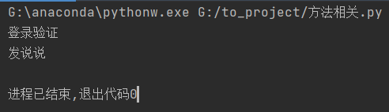
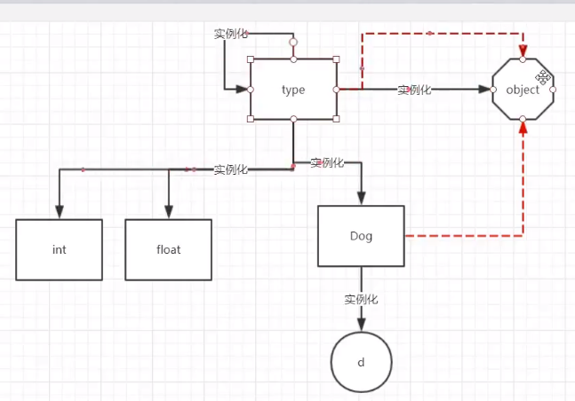
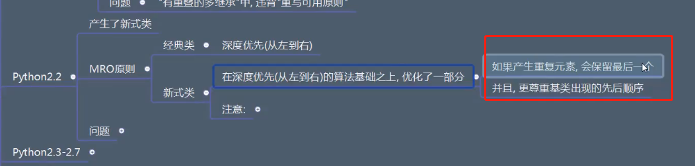
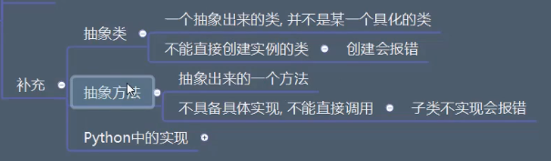

# 面向对象编程
## 19-python-面向对象-类属性-删除属性
```python
# p19删除属性
class Money:
    age = 18
    count = 1
    num = 666

one = Money()

del Money.age

print(one.age)
print(Money.age)
```
使用“**del**”进行删除


>*注意：但不可以直接通过删除对象里面的属性来实现*


## 20-python-面向对象-类属性的内存存储
在类或者实例对象中，可以通过__dict__来查看其中的属性

```python
class Money:
    pass


one = Money()
one.age = 18
one.height = 180

print(one.__dict__)
```


由于__dict__实际上是一个字典，所以可以通过修改/增加字典中的内容控制实例对象的属性。
```python
class Money:
    pass

one = Money()
one.age = 18
one.height = 180

print(one.__dict__)
one.__dict__ = {'age': 19, 'height': 280, 'name' : "wwz"}
print(one.__dict__)
one.__dict__['sex'] = "male"
print(one.__dict__)
```


**但是，无法通过直接修改__dict__值来修改类中的属性。**

```python
class Money:
    age = 19
    name = 20

Money.__dict__['age'] = 20
```


如果要进行修改，应该使用**setattr**方法进行修改

## 21-python-面向对象-类属性被各个对象所共享
实例对象共享类属性，实例对象中若没有对应属性，则会被一同修改
```python
class Money:
    age = 18


one = Money()
two = Money()

print(one.age)
print(two.age)
```


## 22-python-面向对象-类属性和对象属性总结对比
无笔记
## 23-python-面向对象-限制对象属性的添加__slots__
在类里面使用__slot__列表来规定下面的实例对象中可以添加什么属性。
```python
class Person:
    __slots__ = ["age", "sex"] #列表形式
    pass


p1 = Person()
p1.age = 20
p1.sex = "male"
p1.height = 180  # 此处注意上面没写这个height
```

*因为__slot__列表中没有height，因此报错*

## 24-python-面向对象-方法的讲解说明
无笔记

## 25-python-面向对象-方法的概念和作用
和函数非常类似，是类的方法函数。
```python
class Person:
    def eat(self):
        print(1)
        print(2)
        print(3)


p1 = Person()
p1.eat()
```
## 26-python-面向对象-类、对象、类对象、实例对象、实例的叫法规范

1. 万物皆对象
2. 一般称class类，instance实例
3. 类实例化出了实例对象

## 27-python-面向对象-方法的划分依据
1. 实例方法：默认第一个参数需要接收到一个**实例**
2. 类方法：默认第一个参数需要接收到一个**类**
3. 静态方法：默认参数**无**

注意：
1. 划分依据是：方法第一个参数必须要接受的的数据类型。
2. 不管是哪一种给类型方法，都储存在类当中，没有在实例当中的。
3. 不同类型方法调用方式不同。

```python
class Person:
    def shilifangfa(self):
        print("这是一个实例方法", self)

    @classmethod
    def leifangfa(cls):
        print("这是一个类方法", cls)

    @staticmethod
    def jingtaifangfa():
        print("这是一个静态方法")


p1 = Person()
p1.shilifangfa()
Person.leifangfa()
Person.jingtaifangfa()
```


## 28-python-面向对象-方法的储存问题
类的属性在类中，不在实例中。可以从__dict__中查看

## 29-python-面向对象-小节掌握说明
无笔记

## 30-python-面向对象-实例方法
```python
class Person:
    def eat(self, food):
        print("在吃饭", self, food)


p = Person()
p.eat("banana")
print(p)
```

第一个参数是self，就是实例本身，不用主动传入。

可以看到self和p的输出都是一样的

## 31-python-面向对象-类方法
```python
class Person:
    @classmethod
    def leifangfa(cls, a):
        print("这是一个类方法", cls, a)


# 用类去调用
Person.leifangfa(123)

# 用实例去调用
p = Person()
p.leifangfa(666)

# 先赋值给另一个变量，再来调用
func = Person.leifangfa  # 这里不调用，所以不用写()
func(111)  # 这里调用，写()


# 如果是继承关系的子类调用，这cls是调用的子类
class A(Person):
    pass
A.leifangfa(0)
```

*这里因为是A类调用的类方法，所以传过去的class是A而不是Person*

## 32-python-面向对象-静态方法
```python
class Person:
    @staticmethod
    def jingtai():
        print("这是一个静态方法")


Person.jingtai()  # 可以使用类class来调用

p = Person()  # 可以使用实例instance来调用
p.jingtai()

func = Person.jingtai  # 也可间接调用
func()
```
## 33-python-面向对像-不同类型的方法中访问不同类型的属性的权限问题
```python
class Person:
    age = 10
    def shilifangfa(self):
        print("实例方法")

    @classmethod
    def leifangfa(cls):
        print("类方法")

    @staticmethod
    def jingtaifangfa():
        print("静态方法")

p = Person()

# Person.shilifangfa()  # 这里会报错，无法通过类访问实例方法
p.shilifangfa()

Person.leifangfa()
p.leifangfa()

Person.jingtaifangfa()
p.jingtaifangfa()
```
1. 实例方法只能通过实例访问。
2. 类方法可以通过类和实例访问。
3. 静态方法可以通过类和实例访问。
4. **主要原因是实例方法传入了self参数，也就是实例本身；类方法传入了cls，也就是类本身。而静态方法没有传入任何参数。**
5. 实例属性和类属性同理。

## 34-python-面向对象-补充-元类
元类是创建类的类


```python
a = 10

b = "abc"

class Person:
    pass
p = Person()

print(a.__class__)  # 创建数字的类是int
print(b.__class__)  # 创建字符串的类是str
print(p.__class__)  # p的类是Person

print(a.__class__.__class__)
print(b.__class__.__class__)
print(p.__class__.__class__)
print(type.__class__)   # type创造type
```


**注意，type的类是type**

## 35-python-面向对象-补充-类对象的创建方式
```python
def run(self):
    print("running......")


# 使用元类type创建一个类
xxx = type("Dog", (), {"count": 0, "run": run})

print(xxx)
print(xxx.__dict__)

a = xxx()
print(a.count)
a.run()
```
1. 使用元类type可以创建一个类
2. type的用法
   1. 打括号，传东西进去做判断。如：type("abc")，输出：string
   2. type(类名, (继承类), {类属性及类方法})
3. 这里需要用个xxx去接收函数。但类名并不是xxx，而是Dog。

## 36-python-面向对象-补充-类对象创建时，元类的查找机制
```python
__metaclass__ = xxx

def Animal:
    pass

def Person(Animal):
    # __metaclass__ = xxx
    pass
```
1. 使用 __metaclass__ = xxx 来指定元类
2. 元类找查顺序：
   1. 先在自身里面找，有没有指定的__metaclass__
   2. 若没有，找自己的父类，看父类有没有指定的__metaclass__
   3. 若还是没有则看模块内有没有指定的__metaclass__
   4. 若还没有，则元类默认为type

## 37-python-面向对象-补充-类的描述
```python
class Person:
    """
    关于这个类的描述，类的作用，构造函数等等。
    Attributes:
        count: int 代表人的个数
    """
    count = 1

    def run(self, distance, step):
        """
        这个方法的作用
        :param distance: 参数含义，类型，是否有默认值
        :param step: 。。。。。
        :return: 返回结果的含义，返回数据的类型
        """
        print("人在跑")
        return distance / step

help(Person)
```

1. 使用三个双引号来进行注释。
2. 一般需要对类和方法进行注释。
3. 方法里面三个双引号IDE可以根据参数生成注释模板。
4. 使用help(类名),可以查看文档。
5. 由于类名注释中不会有模板生成，所以一般自己写一个Attributes来描述类属性。
   
## 38-python-面向对象-补充-注释文档的生成(抽取源文件的注释)
应用场景：在后续生成项目文档的时候，一般人只关心函数名和参数的解释，不太关系具体的代码实现。为了方便，一般可以使用pydoc来生成项目文档。

使用方法：在cmd模式下面，使用**python -m pydoc**开启
*-m的意思是当作模块运行*

pydoc有几种使用方式：（也可用-h来查看说明）
1. python -m pydoc <文件名>      # 直接打开一个模块，并导出其中注释
2. python -m pydoc -k <关键字>   # 列出文件名中包含关键字的文件
3. python -m pydoc -p <端口号>   # 指定一个未用的端口号
4. python -m pydoc -b            # 自动指定端口号
5. python -m pydoc -w <文件名>   # 在当前目录生成一个对应模块的html文件

具体方法：
1. 先把cmd路径调成模块所在路径。可以右击pycharm的文件夹，选择复制路径，然后再cmd中使用cd命令

2. 一般使用**python -m pydoc -b**，来打开一个网页查看。

这里自动分配了一个端口号，但是同时有很多内置函数的信息。
3. 因此，可以使用**python -m pydoc -w <文件名>**来对需要的模块生成一个html文件。只需要在cmd中输入“python -m pydoc -w .\test1.py”，就可以在pycharm里面找到这个html文件。（-w是写入的意思，写一个html文件）

右键，用浏览器打开这个可以看到只有test1这个模块的描述。


这里可以看到，class和类外面的函数是分开存放的。

## 39-python-面向对象-补充-私有化属性的概念和意义
保证数据安全性，外部无法随意访问、修改。

## 40-python-面向对象-补充-访问权限测试区域划分
**注意：python并没有真正的私有化支持，但是，可以使用下划线完成伪私有的效果，如_y、__z**。其他的语言有些可以通过关键字来控制访问权限。

验证资源在以下几个位置是否能够访问：
1. 类内部
2. 子类内部
3. 模块内部
4. 跨模块访问


## 41-python-面向对象-私有化属性-共有属性
先实现在模块内部的访问
```python
class Animal:
    x = 10
    def test1(self):
        print(Animal.x)  # 通过类来在类内部访问
        print(self.x)  # 这里建了一个实例，实例self传入后在内部访问
    pass


class Dog(Animal):
    def test2(self):
        print(Dog.x)  # 这里是子类通过类来在类外面访问
        print(self.x)  # 子类的实例在类外面访问
    pass


a = Animal()
a.test1()

d = Dog()
d.test2()

print(Animal.x)  #在模块其他位置进行访问
print(Dog.x)
print(a.x)
print(d.x)
```

都可以访问到

跨模块访问
```python
import test1
d = test1.Dog()
d.test2()
```

也可以访问到
另外，如果使用“from test1 import *”则可以直接调用test的资源
```python
# import test1
# d = test1.Dog()
# d.test2()

from test1 import *
d = Dog()
d.test2()
```
因此，**公有属性不管是类内部、类外部、模块内部、跨模块都可以访问。**


## 42-python-面向对象-补充-私有化属性-受保护的属性
受保护的属性就是在属性前面加一个“_”
```python
class Animal:
    _x = 10
    def test1(self):
        print(Animal._x)  # 通过类来在类内部访问
        print(self._x)  # 这里建了一个实例，实例self传入后在内部访问
    pass


class Dog(Animal):
    def test2(self):
        print(Dog._x)  # 这里是子类通过类来在类外面访问
        print(self._x)  # 子类的实例在类外面访问
    pass


a = Animal()
a.test1()

d = Dog()
d.test2()

print(Animal._x)  #在模块其他位置进行访问
print(Dog._x)
print(a._x)
print(d._x)
```
提示都可以访问到，不过在模块其他位置访问会有提示。
跨模块访问使用“import test1”可以访问到，但使用“from test1 import *”会报错。

一般情况，会在原来的文件写一个“\_\_all__ = [...]”来确定可以被调用的属性，括号里面写字符串。这样就可以被调用了。
```python
_a = 666
__all__ = ["_a"]
```
```python
from test1 import *
print(_a)
```
因此，其情况如下：


## 43-python-面向对象-私有化属性-私有属性
私有属性添加两个下划线“__”就好了。私有属性只能在类的内部进行访问，子类，模块内部无法访问。而跨模块则判定为**带两个下划线的变量**，而不是私有变量。
```python
class Animal:
    __x = 10
    def test1(self):
        print(Animal.__x)  # 通过类来在类内部访问
        print(self.__x)  # 这里建了一个实例，实例self传入后在内部访问
    pass


class Dog(Animal):
    def test2(self):
        print(Dog.__x)  # 这里是子类通过类来在类外面访问
        print(self.__x)  # 子类的实例在类外面访问
    pass


a = Animal()
a.test1()

d = Dog()
d.test2()

print(Animal._x)  #在模块其他位置进行访问
print(Dog._x)
print(a._x)
print(d._x)
```


跨模块访问仅被识别为带两个下划线的变量，跟受保护的变量一样，使用直接import可以访问，使用from...import需要配合__all__ = [...]才有效
```python
_a = 666
__all__ = ["_a"]
```
```python
import test1
print(test1.__a)

from test1 import *
print(__a)
```
访问情况如下：


## 44-python-面向对象-补充-私有化属性-私有属性-名字重整机制
1. 实际上，如果一个属性变成了私有属性，实际上是这个属性名字被改掉了。
2. 名字重整：改_x为另外一个名称，如：**_类名__x**。
3. 名称重整的目的在于：
   1. 防止外界直接访问
   2. 防止被子类同名称属性覆盖


由于我们知道名称的重整机制，所以其实可以用新的名字去访问这个属性。
```python
class Animal:
    __x = 10
    def test1(self):
        print(Animal.__x)
        print(self.__x)


print(Animal.__dict__)
print(Animal._Animal__x)
```

可以在__dict__中找到_Animal__x这个属性。
所以私有化操作实际上把x名称变成了_Animal__x。
**但是，实操中尽量不要这么用，因为私有化的意义就是不让外界调用。**

## 45-python-面向对象-补充-私有属性的应用场景
```python
class Person:
    def __init__(self):
        self.__age = 18


p1 = Person()
p1.__age = 10

print(p1.__dict__)
```

这样写会__dict__里面会有两个，后面的私有化赋值实际上是生成了一个新的属性，原有的属性并没有被覆盖，原因是属性的名称已经被修改成了_Person__age。
```python
class Person:
    def __init__(self):
        self.__age = 18

    def setAge(self, value):
        if isinstance(value, int) and 0 < value < 200:
            self.__age = value
        else:
            print("数据有误")

    def getAge(self):
        return self.__age


p1 = Person()
p1.setAge(30)
print(p1.getAge())
```
1. 使用isinstance来判断某个属性是不是预期的类型
2. 面向对象的思想中一般调取数据、读写数据会写一个专门的函数，而不是直接进行修改。使用私有变量可以形成一层保护。
3. return的数据需要print。

## 46-python-面向对象-补充-变量添加下划线的规范
1. xx_：避免与系统关键字冲突，如：class_
2. 双下划线__xx__：系统内置，如__dict__

## 47-python-面向对象-补充-只读属性的概念和意义
只读属性的概念：一个属性只能读取，不能写入

## 48-python-面向对象-补充-只读属性-方案一
完成只读的第一个方案，先通过私有属性让外界无法读取，然后给一个读取的实例方法来实现只读。
```python
class Person:
    def __init__(self):
        self.__age = 20

    def getAge(self):
        return self.__age


p1 = Person()
print(p1.getAge())
```
## 49-python-面向对象-只读属性-方案一的优化

使用上面的方法来进行只读操作有两个问题：
1. 一般属性的读取都是类似p1.age这种调用属性的方式，而这里需要调用一个函数，不是很方便。
2. 后续使用中，如果写了一个p1.age = 50，则会让使用者误认为写入成功。而实际上是有_Person__age, age两个属性，这里只是做了一个新增。

因此，我们使用一个装饰器“**@property**”。这个装饰器的作用是，能够以读取属性的方式调用方法。实际上这个装饰器用于属性方法的增删改查。

```python
class Person（object）:
    def __init__(self):
        self.__age = 20

    @property
    def age(self):
        return self.__age


p1 = Person()
print(p1.age)
p1.age = 50
```

可以看到这里在调用属性的时候没有加括号，且这个属性是无法写入的。
注意：如果要使用只读功能，需要让类继承自object（习惯，以免py2报错）。

## 50-python-面向对象-property的作用
property的作用:将“一些属性的操作方法”关联到另一个属性，间接地管理私有属性。
```python
class C(object):
    def getx(self): return self._x
    def setx(self,value): self._x = value
    def delx(self): del self._x
    x = property(getx, setx, delx)
```
可以查看Python官方文档。

## 51-python-面向对象-补充-经典类和新式类
1. 经典类：没有继承自object
2. 新式类：继承自object，在Python3中，不管写不写object，都会继承自object。
3. 不管是在哪个版本中，建议都写上object，zen of Python中写道，显式优于隐式。
```python
class Person:
    pass


print(Person.__class__)
print(Person.__bases__)
```
这里使用__bases__来查看一个类的父类，区别以下元类type，这个是创建类的一个类。而object是这个类的父类。object的元类也是type。


## 52-python-面向对象-补充-property在新式类中的使用
property实际上有两种用法，官方文档中也写了有函数用法和装饰器用法。文档中这么写道
```python
class C(object):
            def getx(self): return self._x
            def setx(self, value): self._x = value
            def delx(self): del self._x
            x = property(getx, setx, delx, "I'm the 'x' property.")
        
        Decorators make defining new properties or modifying existing ones easy:
        
        class C(object):
            @property
            def x(self):
                "I am the 'x' property."
                return self._x
            @x.setter
            def x(self, value):
                self._x = value
            @x.deleter
            def x(self):
                del self._x
```
1. 函数用法
注意property参数第一个位置是读取，第二个是写入，第三个是删除
给property赋值的名字，就是之后调用的名字，调用可以不用写括号，当作属性来使用。
```python
class Person(object):
    def __init__(self):
        self.__age = 18

    def get_age(self):
        return self.__age

    def set_age(self, value):
        self.__age = value

    age = property(get_age, set_age)


p = Person()
print(p.age)
```

2. 装饰器用法
   1. 装饰器用法中，get，set，del函数名统一。
   2. get的装饰器是@property，set的装饰器是age.setter，del的装饰器是age.deleter
   3. 后面就可以按照使用属性的方式使用方法
```python
class Person(object):
    def __init__(self):
        self.__age = 18

    @property
    def age(self):
        return self.__age

    @age.setter
    def age(self, value):
        self.__age = value


p = Person()
print(p.age)
p.age = 100
print(p.age)
print(p.__dict__)
```
## 53-python-面向对象-补充-property在经典类中的使用(切换版版本为python2)
在经典类中，property只会关联读取方法，不会关联设置和删除方法。
```python
class Person(object):
    def __init__(self):
        self.__age = 18
    def get_age(self):
        ruturn self.__age
    def set_age(self, value):
        self.__age = value
    age = property(get_age, set_age)
    
p = Person()
print(p.age)   #可以读取，不会报错

p.age = 30     #不会设置属性，而是增加了一个age属性
print(p.age)
print(p.__dict__) #输出_person__age和age

#--------------------------

#         装饰器方法

#--------------------------
class Person(object):
       def __init__(self):
           self.__age = 18
       @property
       def age(self):
           return self.__age
       @age.setter
       def age(self, value):
           delf.__age = value
          
   p = Person()
   print(p.age)   #可以读取，不会报错

   p.age = 30     #不会设置属性，而是增加了一个age属性
   print(p.age)

   print(p.__dict__) #输出_person__age和age
```
仅做了解，之后都用新式类就好了。

## 54-python-面向对象-只读属性-方案二
之前的property的方案拿来做只读，有一个问题。就是如果别人直接修改_Person__age, 或者直接通过__dict__[_Person__age]还是可以进行修改。
因此，这里使用一个内置方法__setattr__来实现。但是这个只能防止通过_Person__age修改，直接改字典内容的话还是无法避免。
```python
class Person(object):
    # 当我们使用“实例.属性 = 值”（如p.age = 100）的方法来给一个实例添加属性或者添加属性的时候，都会调用__setattr__这个方法。
    # 在这个方法内部，可以把属性及对应的值存到对应的__dict__中。
    # 在写下p.age = 100时，age->key, 100->value。
    # 但此时并没有存到__dict__中，需要再写一行添加进去。
    def __setattr__(self, key, value):
        print(key, value)
        ## 只读属性一般已经在字典中，如果不满足，识别为新增
        if key == "age" and key in self.__dict__.keys():
            print("这是个只读属性")
        else:
            self.__dict__[key] = value


p1 = Person()
p1.age = 18
print(p1.age)
print(p1.__dict__)

p1.age = 100
print(p1.__dict__)
```


1. 当我们使用“实例.属性 = 值”（如p.age = 100）的方法来给一个实添加属性或者添加属性的时候，都会调用__setattr__这个方法。
2. 在这个方法内部，可以把属性及对应的值存到对应的__dict__中。
3. 在写下p.age = 100时，age->key, 100->value。但此时并没有存到__dict__中，需要再写一行添加进去。

## 55-python-面向对象-常用内置属性

类属性：

类属性__dict__
类的**所有**父类构成元组__bases__
```python
class C(object):
    pass


class B(object):
    pass


class A(C, B):
    pass


print(A.__bases__)
```

类的文档字符__doc__
名__name__
类定义所在模块__module__

实例属性：

类的实例__dict__
实例对应的类__class__

## 56-python-面向对象-补充-私有方法
```python
class Person(object):
    __age = 18

    def __run(self):
        print("run")

    def _Person__run(self):  # 切记不要这样去定义方法，会对私有方法进行覆盖。
        print("xxx")


p = Person()
p._Person__run()
```
私有方法与私有属性相同，都是在**名字前面加两个下划线**。
名称重整机制跟私有属性也相同。

## 57-python-面向对象-补充-内置特殊方法-使用意义


## 58-python-面向对象-内置特殊方法-\_\_str\_\_、\_\_init__
\_\_init__是作为一个初始化工具，可以让实例生成的时候自带一些属性。其中也可以传入一些参数。
```python
class Person(object):
    def __init__(self, name, age):
        self.name = name
        self.age = age


p1 = Person("sz", 18)
print(p1.name)
print(p1.age)

p2 = Person("zhangsan", 19)
print(p2.name)
print(p2.age)
```


\_\_str__的作用是，在要求调用实例的时候可以格式化输出想要的资源。
如下，在要求打印实例p1时，打印出来的是p1实例的内存地址
```python
class Person(object):
    def __init__(self, name, age):
        self.name = name
        self.age = age


p1 = Person("sz", 18)
print(p1.name)
print(p1.age)

p2 = Person("zhangsan", 19)
print(p2.name)
print(p2.age)

print(p1)
```


在使用了\_\_str__之后，可以输出格式化的数据。
```python
class Person(object):
    def __init__(self, name, age):
        self.name = name
        self.age = age

    def __str__(self):
        return "这个人叫%s，他%s岁"%(self.name, self.age)


p1 = Person("sz", 18)
print(p1.name)
print(p1.age)

p2 = Person("zhangsan", 19)
print(p2.name)
print(p2.age)

print(p1)
print(p2)
```


补充：触发\_\_str__的方法有两个，一个是print()，一个是str()
但两个的调用方式有本质区别，先看下用str()如何：
```python
x = str(p1)
print(x)
```
使用print(p1)意思是找到\_\_str__方法对应的返回值。
而使用str(p1)是用str()函数找到对应实例的字符串，再赋值给x。

## 59-python-面向对象-内置的特殊方法-\_\_repr__
1. \_\_repr__和\_\_str__两个都是向用户输出信息。\_\_str__一般向用户输出，\_\_repr__一般向开发人员输出。
2. 在实现了\_\_str__后，print()函数就不会再输出内存信息，如果要查看内存信息，可以使用repr()函数
```python
class Person(object):
    def __init__(self, name, age):
        self.name = name
        self.age = age

    def __str__(self):
        return "这个人叫%s，他%s岁"%(self.name, self.age)


p1 = Person("sz", 18)
print(p1)
print(repr(p1))
```


3. \_\_repr__和\_\_str__的调用优先级
   1. 只有\_\_repr__时，使用print()会调用\_\_repr__的返回值（跟\_\_str__一样）。
   2. 但当同时存在\_\_repr__和\_\_str__方法时，使用print()会调用\_\_str__的返回值。
   3. 在命令行模式下，直接回车输出（不使用print），则会输出\_\_repr__的返回值。
```python
class Person(object):
    def __init__(self, name, age):
        self.name = name
        self.age = age

    def __str__(self):
        return "str"

    def __repr__(self):
        return "repr"


p1 = Person("sz", 18)
print(p1)
```


## 60-python-面向对象-内置特殊方法-\_\_call__-概念和作用
在创建好一个实例后，直接调用一个实例会报错。但使用\_\_call__后，可以让这个实例可以像方法一样被调用（就是一个函数后面加个括号的函数调用形式）
```python
class Person(object):
    pass


p1 = Person()
p1()  # 实例这样无法直接被调用
```


但在使用了\_\_call__后可以被直接调用，并可以返回值
```python
class Person(object):
    def __call__(self, *args, **kwargs):
        print("这是实例调用的返回值")
        pass


p1 = Person()
p1()
```


**补充**：关于参数arg,*args,**kwargs的用法
1. 如果只有一个参数则默认第一个参数是arg。
2. 如果有多个参数，但又不确定的，会作为一个元组全部传给*args。
3. 如果有对应的赋值类型的，又不确定有几对，会作为一个字典全部传给**kwargs。
```python
def func(arg, *args, **kwargs):
    print(arg)
    print(args)
    print(kwargs)

func(1, 2, 2, 3, 4, name = "wwz", age = 30)
```


注意：
1. 实际上就是传入所有的参数，但又不知道参数有多少的情况。
2. 注意，使用print()打印参数时，不用带*号。
3. 注意 name = "wwz" 是这种形式，前面字符串不带引号，中间是等于号。不是像字典一样用引号连接key和value。
4. arg只接收第一个参数。
5. 后面字典类型的参数不能分开写
   ```python
   func(name = "wwz", 2, 2, 3, 4, age = 30)
   ```
   这种写法是不行的。

## 61-python-面向对象-\_\_call__应用场景的简单案例
偏函数的一个应用：
要求：
1. 输出“创建了一个xx类型的钢笔，它是yy颜色”。
2. 当一边确定之后，只用传一个参数，这就是偏函数。

实现方法：
1. 直接复制粘贴（重复代码太多，不适用）
```python
def createPen(p_type, p_colour):
    print(f"创建了一个{p_type}类型的画笔，它是{p_colour}颜色")
    # print("创建了一个%s类型的画笔，它是%s颜色" % (p_type, p_colour))


createPen("钢笔", "黄色")
createPen("钢笔", "绿色")
createPen("钢笔", "红色")
```
2. 使用偏函数（functools中的partial）
```python
def createPen(p_type, p_colour):
    print(f"创建了一个{p_type}类型的画笔，它是{p_colour}颜色")
    # print("创建了一个%s类型的画笔，它是%s颜色" % (p_type, p_colour))


import functools
gangbifunc = functools.partial(createPen, p_type="钢笔")
gangbifunc("黄色")
```
   1. 偏函数使用首先要导入functools库。
   2. functools中的partial函数的用法，传入两个参数。第一个是需要进行偏函数处理的函数，第二个参数是偏向的参数及他的固定值。
   
但是，这里有个问题，运行起来发现报错，提示多重赋值。

原因是，gangbifunc("黄色")这样写会让"黄色"进入到createPen函数中p_type参数里面。调整方法有两个：
1. 把gangbifunc("黄色")改成gangbifunc(p_colour="黄色")
2. 把def createPen(p_type, p_colour)两个参数位置调换，变成def createPen(p_colour, p_type)
```python
def createPen(p_colour, p_type):
    print(f"创建了一个{p_type}类型的画笔，它是{p_colour}颜色")
    # print("创建了一个%s类型的画笔，它是%s颜色" % (p_type, p_colour))


import functools
gangbifunc = functools.partial(createPen, p_type="钢笔")
gangbifunc("黄色")
```
3. 使用类和\_\_call__方法(高级且简单且不用导入库)
```python
class PenFactory(object):

    def __init__(self, p_type):
        self.p_type = p_type

    def __call__(self, p_color):
        print(f"创建了一个{self.p_type}类型的钢笔，它的颜色是{p_color}")


gangbiF = PenFactory("钢笔")
gangbiF("黄色")
```
   1. 在初始化中传入第一个需要固定的参数
   2. 通过\_\_call__再接收可变参数，并通过这个直接输出
   3. 实例化后，因为有\_\_call__，所以可以直接把实例当作函数用。

## 62-python-面向对象-索引操作（使对象具有像字典一样的索引操作）
在Python中，可以像字典一样来操作类属性。
在字典中是这么操作的：
增、改：p[1] = 666、p['name'] = sz
查：p[name]、p[1]
删除：del p[name]、del p[1]

而在类中，通过实现三个方法，可以让类也具有这种功能。他们分别是：
```python
def __setitem__(self, key, value):  # 设置属性
def __getitem__(self, key): # 查询属性
def __delitem__(self, key): # 删除属性
```
如果没有实现这三个方法，直接操作会报错：
```python
class Person(object):
    pass


p = Person()
p["name"] = "sz"
```
提示不支持赋值：


但是，实现了方法之后数据不会被保存：
```python
class Person(object):

    def __setitem__(self, key, value):
        print("setitem", key, value)

    def __getitem__(self, item):
        print("getitem", item)

    def __delitem__(self, key):
        print("delitem", key)


p = Person()

p["name"] = "sz"
print(p["name"])
del p["name"]
```

可以看到，方法虽然被实现，但是getitem并没有拿到实际的数据。因此可以判断数据并没有被保存下来。所以，我们需要人为的给这个实例一个储存空间。而一个字典是最为合适的，因为赋值一般会有key和value。所以，我们给所有的实例都加一个初始化好的空字典。而其中的操作都手动实现。
```python
class Person(object):

    def __init__(self):
        self.cache = {}

    def __setitem__(self, key, value):
        self.cache[key] = value

    def __getitem__(self, item):
        return self.cache[item]

    def __delitem__(self, key):
        del self.cache[key]


p = Person()

p["name"] = "sz"
print(p.cache)

print(p["name"])

del p["name"]
print(p.cache)
```


## 63-python-面向对象-切片操作
切片操作跟列表的切片操作一样：
```python
l = [1, 2, 3, 4, 5, 6]
print(l[1: 4: 2])
```

这里切片是[开始：结束：步长]
在类中实现跟上面相同，需要实现三个方法：
```python
def __setitem__(self, key, value):  # 设置
def __getitem__(self, key): # 查询
def __delitem__(self, key): # 删除
```
而切片实际返回的是一个slice对象：
```python
class Person(object):
    def __setitem__(self, key, value):
        print(key, value)


p = Person()
p[0: 4: 2] = [1, 2]
```


因此，我们可以知道slice对象实际上是由start，stop，step组成。测试如下：
```python
class Person(object):
    def __setitem__(self, key, value):
        print(key.start)
        print(key.stop)
        print(key.step)
        print(value)


p = Person()
p[0: 4: 2] = [1, 2]
```

key.start = 0
key.stop = 4
key.step = 2
value = [1, 2]

```python
class Person(object):

    def __init__(self):
        self.items = [1, 2, 3, 4, 5, 6, 7, 8]

    def __setitem__(self, key, value):
        if isinstance(key, slice):
            self.items[key] = value
            # self.items[key.start: key.stop: key.step] = value

    def __getitem__(self, item):
        if isinstance(item, slice):
            return self.items[item]

    def __delitem__(self, key):
        if isinstance(key, slice):
            del self.items[key]


p = Person()

p[0: 4: 2] = ["a", "b"]
print(p.items)

print(p[0: 4: 1])

del p[0: 3: 1]
print(p.items)
```

这里注意几点：
1. 切片操作一般只能修改、查询，不能新增
2. 一般需要判断传入的是不是slice格式

## 64-python-面向对象-比较操作-映射的内置方法
这里的比较操作，是对两个实例，按照用户的标准进行大小比较
方法如下：
1. \_\_eq__ equal 等于
2. \_\_ne__ not equal 不等于
3. \_\_gt__ greater 大于
4. \_\_ge__ greater equal 大于等于
5. \_\_lt__ less than 小于
6. \_\_le__ less than equal 小于等于
如果不实现上述方法而对实例进行比较，会报错。

举个判断是否等于的例子：

```python
class Person(object):

    def __init__(self, age, height):
        self.age = age
        self.height = height

    def __eq__(self, other):
        return self.age == other.age


p1 = Person(18, 180)
p2 = Person(17, 200)
print(p1 == p2)
```

这里由于返回的只是self和other的age，所以另一个height参数不管是多少都不会影响结果。

**当实现了\_\_eq__，而尝试判断不相等时，也是可以运行的。所以只要实现了一个，另一个相反的操作也可以运行。但如果同时实现了\_\_ne__，则会优先选择执行\_\_ne__，因为这个才是真正的不等于。**

对比如下：

```python
class Person(object):

    def __init__(self, age, height):
        self.age = age
        self.height = height

    def __eq__(self, other):
        print("---equal---")
        return self.age == other.age

    # def __ne__(self, other):
    #     print("---not equal---")
    #     return self.age != other.age


p1 = Person(18, 180)
p2 = Person(17, 200)
print(p1 == p2)
print(p1 != p2)
```


---

```python
class Person(object):

    def __init__(self, age, height):
        self.age = age
        self.height = height

    def __eq__(self, other):
        print("---equal---")
        return self.age == other.age

    def __ne__(self, other):
        print("---not equal---")
        return self.age != other.age


p1 = Person(18, 180)
p2 = Person(17, 200)
print(p1 == p2)
print(p1 != p2)
```


## 65-python-面向对象-比较操作-映射的内置方法

在比较操作中，实现了小于也相当于实现了大于。原因很简单。比如要判断p1 < p2,也等同于判断p2 > p1。
```python
class Person(object):

    def __init__(self, age, height):
        self.age = age
        self.height = height

    def __lt__(self, other):
        print(self.age)
        print(other.age)
        return self.age < other.age


p1 = Person(18, 180)
p2 = Person(19, 200)

print(p1 < p2)
print("----------")
print(p1 > p2)
```

可以发现p1和p2的值在大于判断中被调换了。

## 66-面向对象-比较操作-方案2（通过装饰器自动补全）
注意，两个方法无法叠加。下面的写法是错误的。
```python
class Person(object):

    def __init__(self, age, height):
        self.age = age
        self.height = height

    def __eq__(self, other):
        return self.age == other.age

    def __lt__(self, other):
        return self.age < other.age


p1 = Person(18, 180)
p2 = Person(19, 200)

print(p1 <= p2)
```


但是，实际上，在实现了小于和等于之后，理论上可以推导出不等于、大于、小于等于、大于等于所有判断。这时候我们需要用到**functools中的total_ordering**来实现自动补全。（需要import functools，并使用装饰器@functools.total_ordering）

```python
import functools


@functools.total_ordering
class Person(object):

    def __init__(self, age, height):
        self.age = age
        self.height = height

    def __eq__(self, other):
        return self.age == other.age

    def __lt__(self, other):
        return self.age < other.age


p1 = Person(18, 180)
p2 = Person(19, 200)

print(p1 <= p2)
print(Person.__dict__)
```

在Person的\_\_dict__中可以看到gt_from_lt

## 67-python-面向对象-比较操作-上下文布尔
在Python中：
1. 非0即真
2. 非空即真

```python
if 1:
    print("即真")

if "abc":
    print("即真")


class Person(object):
    pass


p = Person()

if p:
    print("即真")
```

这里有意思的是，一个实例竟然当作True来运行了。
如果要控制一个实例的真假，可以使用到\_\_bool__方法。
```python
if 1:
    print("即真")

if "abc":
    print("即真")


class Person(object):

    def __bool__(self):
        return False


p = Person()

if p:
    print("即真")
else:
    print("假")
```
我们在实现了\_\_bool__方法后，返回一个False，这个实例就可以为假。我们可以利用这个来做一些判断。

比如我们这里来判断是否成年：
```python
class Person(object):

    def __init__(self, age):
        self.age = age

    def __bool__(self):
        return self.age < 18


def chengnian(x):
    if x:
        print("成年")
    else:
        print("未成年")


p1 = Person(16)
p2 = Person(20)

chengnian(p1)
chengnian(p2)
```


## 68-python-面向对象-遍历操作-\_\_getitem__

一般实现遍历，会用到两种方法：
1. for...in...
2. 使用next迭代

**for...in...在实例的实现，需要实现\_\_getitem__方法或者\_\_iter__方法。**

如果不用上面的方法，直接对实例进行遍历，则会提示不可被迭代：
```python
class Person(object):
    pass


p = Person

for i in p:
    print(i)
```


我们首先来实现\_\_getitem__方法：
```python
class Person:
    def __getitem__(self, item):
        return 1
    pass


p = Person()

for i in p:
    print(i)
```

可以看到虽然可以成功打印出来，但是由于没有退出条件，它会无止境地运行下去。
因此，我们在\_\_getitem__方法里面加上判断语句，并return遍历结果：
```python
class Person:
    
    def __init__(self):
        self.result = 1
        
    def __getitem__(self, item):
        self.result += 1
        if self.result > 6:
            raise StopIteration("停止遍历")
        return self.result


p = Person()

for i in p:
    print(i)
```


## 69-python-面向对象-遍历操作-\_\_iter__
在\_\_getitem__和\_\_iter__方法同时存在时，\_\_iter__方法拥有更高的优先级。
```python
class Person:

    def __getitem__(self, item):
        print("getitem")

    def __iter__(self):
        print("iter")


p = Person()

for i in p:
    print(i)
```

这里测出，优先走到\_\_iter__方法里面去了。但是也同时报错，提示返回值并不是一个迭代器。

关于迭代器与可迭代：
```python
l = [1, 2, 3, 4, 5]  # l是可迭代的，但并非迭代器
iter(l) # 使用iter()函数把可迭代的资源变成迭代器
```
因此，\_\_iter__方法和iter()函数的本质都是**把可迭代的数据放进去，返回一个迭代器。**
而迭代器可以使用next()函数访问下一个数据。在上例中，使用for... in ...则会调用实例p中的\_\_next__方法去访问下一个元素。但在类中没有现成的，所以，要手动实现迭代器需要实现\_\_next__方法。

本质：
**可迭代的xxx -> 通过iter()或者\_\_iter__变成迭代器 -> 通过\_\_next__访问下一个元素**

迭代器必须要有\_\_next__方法，不然\_\_iter__方法的return不会被识别为迭代器。
```python
class Person(object):
    def __init__(self):
        self.result = 1

    def __iter__(self):
        return self

    # def __next__(self):
    #     self.result += 1
    #     if self.result > 6:
    #         raise StopIteration("停止遍历")
    #     return self.result


p = Person()

for i in p:
    print(i)
```

加上\_\_next__方法：
```python
class Person(object):
    def __init__(self):
        self.result = 1

    def __iter__(self):
        return self

    def __next__(self):
        self.result += 1
        if self.result > 6:
            raise StopIteration("停止遍历")
        return self.result


p = Person()

for i in p:
    print(i)
```


## 70-python-面向对象-遍历操作-\_\_next__

在实现了\_\_next__方法后，可以通过next()来访问下一个元素:
```python
class Person(object):
    def __init__(self):
        self.result = 1

    # def __iter__(self):
    #     return self

    def __next__(self):
        self.result += 1
        if self.result > 6:
            raise StopIteration("停止遍历")
        return self.result


p = Person()
print(next(p))
print(next(p))
print(next(p))
print(next(p))
print(next(p))
print(next(p))
```


## 71-python-面向对像-遍历操作-迭代器的复用

判断是否是迭代器需要用到一个collections包，下面有一个collections.Iterator，可以用isinstance(p, collections.Iterator)来判断。
```python
class Person(object):

    def __init__(self):
        self.age = 1

    def __iter__(self):
        return self

    def __next__(self):
        self.age += 1
        if self.age >= 6:
            raise StopIteration("stop")
        return self.age


p = Person()

for i in p:
    print(i)

import collections
print(isinstance(p, collections.Iterator))
```


作为一个迭代器，\_\_next__方法、\_\_iter__方法缺一不可，少了其中一个都会报不是迭代器。
```python
class Person(object):

    def __init__(self):
        self.age = 1

    # def __iter__(self):
    #     return self

    def __next__(self):
        self.age += 1
        if self.age >= 6:
            raise StopIteration("stop")
        return self.age


p = Person()
#
# for i in p:
#     print(i)

import collections
print(isinstance(p, collections.Iterator))
```


所以，实际上，\_\_iter__return一个迭代器，再用\_\_next__方法访问才是一个迭代器的完整结构。一个迭代器必然可以用next()访问，而一个可以被next()访问的不一定是一个迭代器。

另外，迭代器在迭代完毕后，会到最后一个元素，是没有办法自动循环从头迭代的。
```python
class Person(object):

    def __init__(self):
        self.age = 1

    def __iter__(self):
        return self

    def __next__(self):
        self.age += 1
        if self.age >= 6:
            raise StopIteration("stop")
        return self.age


p = Person()

for i in p:
    print(i)
for i in p:
    print(i)
```

这里只打印了一次。

```python
class Person(object):

    def __init__(self):
        self.age = 1

    def __iter__(self):
        self.age = 1  # 解决办法是在__iter__方法里面回退到初始状态
        return self

    def __next__(self):
        self.age += 1
        if self.age >= 6:
            raise StopIteration("stop")
        return self.age


p = Person()

for i in p:
    print(i)
for i in p:
    print(i)
```
解决办法是在\_\_iter__方法里面回退到初始状态,因为从头开始遍历会调用它去寻找迭代器。

## 72-python-面向对象-遍历操作-迭代器-可迭代的判定依据

判断一个对象是否可迭代可以使用collections.Iterable，可以用isinstance(p, collections.Iterable)来判断。

```python
class Person(object):

    def __init__(self):
        self.age = 1

    def __iter__(self):
        self.age = 1  # 解决办法是在__iter__方法里面回退到初始状态
        return self

    def __next__(self):
        self.age += 1
        if self.age >= 6:
            raise StopIteration("stop")
        return self.age


p = Person()

for i in p:
    print(i)

import collections
print(isinstance(p, collections.Iterator))
print(isinstance(p, collections.Iterable))
```
Iterator和Iterable，如果一个对象是可迭代对象，只需要实现\_\_iter__方法就好了。而如果要是迭代器，必须实现\_\_iter__方法和\_\_next__方法。
**一个可迭代对象一定可以通过for in访问，可以通过for in访问的不一定是可迭代对象。**

## 73-python-面向对象-遍历操作-iter的使用
iter(<要转换的对象>,<停止数值>)

## 74-面向对象-描述器-概念和作用
描述器用于操作属性，对属性进行过滤、限制等。当一个属性指向到了一个类，类中实现了set、get、delete方法时，外界在调用、赋值、删除属性的时候就会自动调用set、get、delete方法。以此来达到限制数据的操作的目的。


## 75-python-面向对象-描述器-定义方式1-property
这一课是前面学过的，当做复习

一般的属性由于外界很容易修改，所以搞成私有属性。但做成私有属性后，外界无法直接访问，因此给出了查、改、删三个方法。
```python
class Person(object):

    def __init__(self):
        self.__age = 10

    def get_age(self):
        return self.__age

    def set_age(self, value):
        if value < 0:
            value = 0
        self.__age = value

    def delete_age(self):
        del self.__age


p = Person()
print(p.get_age())
p.set_age(30)
print(p.get_age())
# p.delete_age()
# print(p.get_age())
```

但是，一般使用属性都是直接设置或者查询，这边相当于调用了方法，写上去比较麻烦。我们更喜欢p.age = 20 这种直接的赋值方法。因此，我们需要使用到property。
第一种用法是使用property函数
```python
class Person(object):

    def __init__(self):
        self.__age = 10

    def get_age(self):
        return self.__age

    def set_age(self, value):
        if value < 0:
            value = 0
        self.__age = value

    def delete_age(self):
        del self.__age

    age = property(get_age, set_age, delete_age, "property 用法")

    test = 999999
    

p = Person()
print(p.age)
p.age = 60
print(p.age)
# del p.age
# print(p.age)

help(Person)
```

由于实现了property，所以age在数据解释器那一栏，而后面的普通类属性，则在数据和其他属性中。

第二种方法是把property当作装饰器来用。
```python
class Person(object):

    def __init__(self):
        self.__age = 10

    @property
    def age(self):
        return self.__age

    @age.setter
    def age(self, value):
        if value < 0:
            value = 0
        self.__age = value

    @age.deleter
    def age(self):
        del self.__age

    test = 999999


p = Person()
print(p.age)
p.age = 60
print(p.age)
# del p.age
# print(p.age)

help(Person)
```
注意，这里get的解释器是@property，set的解释器是@age.setter，deleter的解释器是@age.deleter。这里名字写一样的是为了方便书写，不一样的也行，但是在用的时候得写一样的。

## 76-python-面向对象-描述器-定义方式2

在上述方法中，一个属性给了三个方法才变成一个数据解释器，如果有很多个属性，这个定义会变得很麻烦，因此，我们把三个方法封装到一个类中，后面要用到的话，就用这个类生成一个实例。
```python
class Age:

    def __get__(self, instance, owner):
        print("get")

    def __set__(self, instance, value):
        print("set")

    def __delete__(self, instance):
        print("delete")


class Person:

    age = Age()


p = Person()
print(p.age)
p.age = 10
print(p.age)
```

## 77-python-面向对象-描述器-调用细节-1
```python
class Age(object):

    def __get__(self, instance, owner):
        print("get")

    def __set__(self, instance, value):
        print("set")

    def __delete__(self, instance):
        print("delete")


class Person(object):

    age = Age()


print(Person.age)
Person.age = 10
del Person.age
```

直接对类进行查询、赋值、删除操作，发现只有查询走了数据解释器。以后做这种操作，一般都是针对实例来做，不要对类来进行操作。

## 78-python-面向对象-描述器-调用细节-2
如果要让数据解释器起作用，Person和Age两个类必须都是新式类。

## 79-python-面向对象-描述器-调用细节-3

计算机自动实现了\_\_getattribute__方法，如果不小心复写了这个方法，则也无法成功调用。

## 80-python-面向对象-描述器-调用优先级
1. 资料描述器：实现了\_\_get__方法和\_\_set__方法。
2. 非资料描述器，仅仅实现了\_\_get__方法
3. 数据操作的优先级为：资料描述器 > 实例属性 > 非资料描述器

```python
class Age(object):

    def __get__(self, instance, owner):
        print("get")

    def __set__(self, instance, value):
        print("set")

    def __delete__(self, instance):
        print("delete")


class Person(object):

    age = Age()

    def __init__(self):
        self.age = 10


p = Person()
p.age = 10
print(p.age)
print(p.__dict__)
```

这里的实例的赋值是失败的，直接走到上面的方法里面去了。

```python
class Age(object):

    def __get__(self, instance, owner):
        print("get")

    # def __set__(self, instance, value):
    #     print("set")
    #
    # def __delete__(self, instance):
    #     print("delete")


class Person(object):

    age = Age()

    def __init__(self):
        self.age = 10


p = Person()
p.age = 10
print(p.age)
print(p.__dict__)
```

但非资料描述器的优先级低于实例，所以这次实例赋值成功。

## 81-python-面向对象-数据储存问题
1. 在上述代码中，set实际上并没有做实际的存储动作。因为没有指定存储位置。
2. Age类是p1、p2共享的，而每个人的年龄应该是不同的，肯定不能存储在共享的类属性中。
3. 通过打印self, instance, value的值，可以看到不同的实例返回的instance地址是不同的。因此属性值存在这里面最合适。

```python
class Age(object):
    def __get__(self, instance, owner):
        print("get", self, instance, owner)

    def __set__(self, instance, value):
        print("set", instance, value)

    def __delete__(self, instance):
        print("delete", instance)


class Person(object):
    age = Age()


p1 = Person()
p2 = Person()

p1.age = 10
p2.age = 11
```


所以，我们使用instance来保存数据：
```python
class Age(object):
    def __get__(self, instance, owner):
        # print("get", self, instance, owner)
        return instance.v

    def __set__(self, instance, value):
        # print("set", instance, value)
        instance.v = value

    def __delete__(self, instance):
        # print("delete", instance)
        del instance.v


class Person(object):
    age = Age()


p1 = Person()
p2 = Person()

p1.age = 10
p2.age = 11

print(p1.age)
print(p2.age)
```


## 闭包-概念格式

```python
def test():
    a = 4

    def test2():
        print(a)

    return test2


newfunc = test()
newfunc()
```


## 闭包-小案例
应用场景，根据不同的参数生成不同功能的函数。
在原来的场景中，函数调用多次就要重新传递参数写的很长：
```python
def line_config(contend, length):
    print("-" * (length // 2) + contend + "-" * (length // 2))


line_config("闭包", 40)

line_config("闭包", 40)

line_config("闭包", 40)
```


但使用闭包，可以写的更加简单：
```python
def line_config(contend, length):
    def line():
        print("-" * (length // 2) + contend + "-" * (length // 2))
    return line


line1 = line_config("闭包", 20)

line1()

line2 = line_config("闭包", 40)

line2()
```


## 闭包-注意事项1
在闭包中，如果要修改外层变量，需要使用 **nonlocal 变量** 声明。否则则会重新生成一个变量（注意不是覆盖）。
```python
def test():
    num = 10

    def test2():
        nonlocal num
        num = 20
        print(num)
    print(num)
    test2()
    print(num)
    return test2


result = test()
```


## 装饰器的概念
装饰器用于给主函数增加一些额外功能，而又不改变主函数原本结构的情况。我们也把装饰器成为语法糖。
这里先实现一个需求，如果我们定义一个函数发说说，在发说说前面需要对身份进行验证，应该要怎么做？
```python
def check(func):
    print("正在登陆。。。")
    func()


def fss():
    print("发说说")


check(fss)
```

一般的想法是这样的，但是，我们本来的目的是执行发说说的这个动作，而登录检测则是一个额外的操作。原先执行fss，现在却变成执行了另一个函数。所以我们做一些优化。

```python
def check(func):
    def inner():
        print("正在登陆。。。")
        func()
    return inner


@check
def fss():
    print("发说说")

#fss = check(fss)  # 这个语法糖等同于这一句。
fss()
```

上面的代码中，外层函数把func传递给内层函数，并在内层函数执行前，多执行了一个print()，然后整体把函数返回给外界（注意这里只是把函数返回了出去，inner不叫括号，暂时不用执行inner函数）。下面使用了@check装饰器，实际上就是把fss当作参数传给了check(func)。在后面运行fss()的时候，实际上就是把inner()运行了。

注意事项，装饰器在@check这一行就已经运行了。而不是等fss先运行。

## 82-python-面向对象-类实现
在上面的例子中，实现了一个装饰器，下面用类来实现一个装饰器。
```python
def check(func):
    def inner():
        print("正在登陆。。。")
        func()
    return inner

#@check
def fss():
    print("发说说")


fss = check(fss)
fss()
```
这里的闭包要如何使用类来实现呢？
首先看fss = check(fss)这一行，看起来像是在定义一个类的实例，并且传入一个初始化参数fss，在类中，容易联想到这样的形式：
```python
class Check(object):
    def __init__(self, fss):
        self.f = fss


fss = Check(fss)
```
而后面的fss()相当于把实例当做函数来运行了，容易想到使用\_\_call__方法。
```python
class Check(object):
    def __init__(self, func):
        self.f = func

    def __call__(self, *args, **kwargs):
        print("登录验证")
        self.f()

@Check
def fss():
    print("发说说")


fss()
```


## 83-python-面向对象-生命周期方法

可以通过\_\_new__观察创建，\_\_del__来观察删除的过程（在删除某一个实例的时候，实际上也会调用这个方法）
```python
class Person(object):
    # def __new__(cls, *args, **kwargs):
    #     print("创建了一个类，但是被我拦截了")

    def __init__(self):
        print("初始化。。")
        self.name = "sz"

    def __del__(self):
        print("这个对象被释放了")


p = Person()
print(p.name)
# del p
```

可以看到在运行完之后，虽然没有使用del，但实例还是被删除了。
当然也可以自己手动删除：
```python
class Person(object):
    # def __new__(cls, *args, **kwargs):
    #     print("创建了一个类，但是被我拦截了")

    def __init__(self):
        print("初始化。。")
        self.name = "sz"

    def __del__(self):
        print("这个对象被释放了")


p = Person()
del p
print(p.name)
```


## 84-python-面向对象-生命周期方法-案例
需求：建立一个Person类，打印一下，当前这个时刻，由Person类产生的实例有多少个。创建了一个实例，计数加一，删除了一个计数减一。

```python
personCount = 0


class Person(object):
    def __init__(self):
        global personCount
        print("计数 + 1")
        personCount += 1

    def __del__(self):
        global personCount
        print("计数 - 1")
        personCount -= 1

    @staticmethod
    def log():
        print("当前的人的个数是%s" % personCount)


p1 = Person()
p2 = Person()
Person.log()

del p1
Person.log()
```

注意：
1. 这里用的personCount必须声明是全局变量，否则无法引用。
2. 由于打印日志中不需要用到类或者实例，因此直接定义为静态方法。
3. 理论静态方法可以使用类来调用，也可以使用实例调用。但在本例中，实例会被删除，是用不便，因此使用类来调用更为合适。

问题：
1. 在本例中，使用全局变量不安全，因为可以随意修改。
改进方法如下：
```python
class Person(object):
    __personCount = 0

    def __init__(self):
        print("计数 + 1")
        Person.__personCount += 1
        # self.__class__.__personCount +=1 这种写法也可以

    def __del__(self):
        print("计数 - 1")
        Person.__personCount -= 1

    @classmethod
    def log(cls):
        print("当前的人的个数是%s" % cls.__personCount)


p1 = Person()
p2 = Person()
Person.log()

del p1
Person.log()
```

1. 这里把personCount变成了一个私有的类属性。
2. 下面的静态方法变成了类方法。

## 85-python-面向对象-内存管理机制-对象存储
1. 在Python中，万物皆对象，不像C及其他语言，存在基本数据类型。
2. 所有的对象，都会开辟一块内存空间进行存储。
3. 但是，像整数、短小的字符，Python会进行缓存，不会创建多个相同对象。
4. 容器对象，存储的不是对象本身，而是一个指向的地址。

```python
class Person(object):
    pass


p1 = Person()
p2 = Person()

print(id(p1))
print(id(p2))   # id()表示查看一个对象的地址
print(hex(id(p1)))  # hex(id())表示把查到的转换为十六进制
print(hex(id(p2)))

p3 = 2
p4 = 2

print(id(p3))
print(id(p4))   # 数字的内存地址相同，并没有新开辟内存空间
```

## 86-python-面向对象-内存管理机制-引用计数器
一个对象的消亡是因为其引用计数器为0造成的。也就是说，当一个对象没有任何引用的情况，就会被计算机从内存中删除。而有一个引用，引用计数器就会加1，每少一个引用，用用计数器就会减1。查看引用计数器需要导入**sys库**，使用sys.getrefcount。**这里注意出来的数据会+1**。


```python
import sys

class Person(object):
    pass


p1 = Person()
print(sys.getrefcount(p1))

p2 = p1
sys.getrefcount(p1)
print(sys.getrefcount(p1))

del p2
print(sys.getrefcount(p1))

# del p1
# print(sys.getrefcount(p1))
```

```python
import sys

class Person(object):
    pass


p1 = Person()
print(sys.getrefcount(p1))

p2 = p1
sys.getrefcount(p1)
print(sys.getrefcount(p1))

del p2
print(sys.getrefcount(p1))

del p1
print(sys.getrefcount(p1))
```


## 87-python-面向对象-内存管理机制-引用计数器


## 88-python-面向对象-内存管理机制-循环引用
引用计数器是无法解决循环引用的问题的。而在Python中，内存管理方面**引用计数器机制和垃圾回收机制是同时存在的**。


当没有循环引用时，直接删除后确实是删除掉了
```python
import objgraph


class Person:
    pass


class Dog:
    pass


p = Person()
d = Dog()

print(objgraph.count("Person"))
print(objgraph.count("Dog"))

# p.pet = d
# d.master = p

# print(objgraph.count("Person"))
# print(objgraph.count("Dog"))

del p
del d

print(objgraph.count("Person"))
print(objgraph.count("Dog"))
```


但是，如果有循环引用，后面两个对象因为相互引用，所以删除掉两个实例后，还是存在。
```python
import objgraph


class Person:
    pass


class Dog:
    pass


p = Person()
d = Dog()

print(objgraph.count("Person"))
print(objgraph.count("Dog"))

p.pet = d
d.master = p

print(objgraph.count("Person"))
print(objgraph.count("Dog"))

del p
del d

print(objgraph.count("Person"))
print(objgraph.count("Dog"))
```

所以引用计数器没有办法识别这种情况。

## 89-python-面向对象-内存管理机制-垃圾检测流程

一般只有容器对象才存在循环引用的问题。一般对象比如a = 10，这种是没办法循环引用的。


## 90-python-面向对象-内存管理机制-分代回收


当0代检测P了10次后，P若还在，则P转入1代。0代继续检测，1代暂不检测。当0代检测100次，1代检测10次后，则P转入2代。设计的初衷在于：若一个对象能够多次存活，则减少它的检测频率，以此来节约内存。

## 91-python-面向对象-内存管理机制-查看以及修改机制配置参数
垃圾回收器当中，新增对象个数-消亡对象个数，达到一定阈值的时候，才会触发垃圾检测机制。

可以通过gc模块中的gc.get_threshold()查询参数，也可以用gc.get_threshold(500, 5, 5)来自定义参数。第一个参数是新增对象个数-消亡对象个数的值，第二个参数是0代检测几次进到1代，第三个参数是1代检测几次进到2代。
```python
import gc

print(gc.get_threshold())
gc.set_threshold(500, 10, 5)
print(gc.get_threshold())
```


## 92-python-面向对象-内存管理机制-垃圾检测机制-触发时机-自动触发

```python
import gc


gc.disable()
print(gc.isenabled())
gc.enable()
print(gc.isenabled())
print(gc.get_threshold())
gc.set_threshold(1500, 15, 15)
print(gc.get_threshold())
```
1. 垃圾回收机制默认是启动的
2. 可以通过gc.disable()关闭，gc.enable()启动，gc.isenabled()查看是否启动。
3. gc.set_threshold(1500, 15, 15)增加阈值能够增加性能，因为垃圾检测比较花时间和内存。

## 93-python-面向对象-内存管理机制-垃圾检测机制-触发时机-手动触发

自动触发有一定限制，就是他会设置一个阈值，没有到阈值前是不会触发垃圾回收的。但是，如果确定在某个位置有需要进行回收的对象，可以使用gc.collect()进行手动处理。
当没有进行垃圾回收处理时，两个类都显示有两个创造的实例关联：
```python
import gc
import objgraph


class Person(object):
    pass


class Dog(object):
    pass


p = Person()
d = Dog()

p.pet = d
d.master = p

del p
del d

# gc.collect()

print(objgraph.count("Person"))
print(objgraph.count("Dog"))
```


而处理完，发现变成0了：
```python
import gc
import objgraph


class Person(object):
    pass


class Dog(object):
    pass


p = Person()
d = Dog()

p.pet = d
d.master = p

del p
del d

gc.collect()

print(objgraph.count("Person"))
print(objgraph.count("Dog"))
```


## 94-python-面向对象-内存管理机制-垃圾检测机制-循环引用解决细节
由于Python2中直接用gc.collect()无法回收垃圾，给出了一个解决方案。

## 95-python-面向对象-友情提示
无笔记

## 96-python-面向对象-小节案例-1
需求，做一个计算器，实现加减乘除的运算.
```python
def jia(n1, n2):
    return n1 + n2


def jian(n1, n2):
    return n1 - n2


def cheng(n1, n2):
    return n1 * n2


res = jia(1, 2)
res2 = jian(1, 2)
res3 = cheng(2, 2)

print(res)
print(res2)
print(res3)

# 如果要计算连续的算式，如2+3-4

r1 = jia(2, 3)
r2 = jian(r1, 4)
print(r2)
```

## 97-python-面向对象-小节案例-2
案例1中，连续赋值很不方便，下面生成一个全局变量，累计到全局变量中。
```python
result = 0


def first(v):
    global result
    result = v


def jia(v):
    global result
    result += v


def jian(v):
    global result
    result -= v


def cheng(v):
    global result
    result *= v


first(2)
jia(6)
jian(1)
print(result)
```

## 98-python-面向对象-小节案例-3
案例2有两个问题：
1. result可以随意更改，不安全。
2. 代码零散。

因此，我们考虑到使用类里面的私有属性来操作，并给一个方法来读取result，外界没那么容易去修改。
```python
class Caculator(object):
    __result = 0

    @classmethod
    def first_value(cls, v):
        cls.__result = v

    @classmethod
    def jia(cls, v):
        cls.__result += v

    @classmethod
    def jian(cls, v):
        cls.__result -= v

    @classmethod
    def cheng(cls, v):
        cls.__result *= v

    @classmethod
    def show(cls):
        print("计算的结果是:%d" % cls.__result)


Caculator.first_value(2)
Caculator.jia(20)
Caculator.jian(8)
Caculator.show()
```


## 99-python-面向对象-小节案例-4
案例3有一个问题，就是如果要计算多个算式，是没有办法做的。因为类属性只有一个。因此，考虑使用实例来操作。

```python
class Caculator(object):
    def __init__(self, value):
        self.__result = value

    def jia(self, value):
        self.__result += value

    def jian(self, value):
        self.__result -= value

    def cheng(self, value):
        self.__result *= value

    def show(self):
        print("计算的结果是：%s" % self.__result)


c1 = Caculator(2)
c1.jia(3)
c1.jian(8)
c1.cheng(3)
c1.show()
```

## 100-python-面向对象-小节案例-5
在案例4的基础上，添加一个数据判断，判断输入的是否为int类型，如果不是，则raise一个TypeError。
```python
class Caculator(object):
    def __init__(self, value):
        if isinstance(value, int):
            self.__result = value
        else:
            raise TypeError("数据类型有问题")

    def jia(self, value):
        if not isinstance(value, int):
            raise TypeError("数据类型有问题")
        self.__result += value

    def jian(self, value):
        if not isinstance(value, int):
            raise TypeError("数据类型有问题")
        self.__result -= value

    def cheng(self, value):
        if not isinstance(value, int):
            raise TypeError("数据类型有问题")
        self.__result *= value

    def show(self):
        print("计算的结果是：%s" % self.__result)


c1 = Caculator(2)
c1.jia(3)
c1.jian(8)
c1.cheng(3)
c1.show()
```
可以看到，这里的\_\_int__方法和加方法采用了两种不同的if类型。在jia方法中，没有加else。如果if没有执行，又没有else，则整个判断不执行。

虽然实现要求，但是判断过程比较重复，因此写一个方法来进行类型判断。之后在其他方法里面来调用这个方法即可。
```python
class Caculator(object):
    def check_number(self, value):
        if not isinstance(value, int):
            raise TypeError("数据类型有问题")

    def __init__(self, value):
        self.check_number(value)
        self.__result = value

    def jia(self, value):
        self.check_number(value)
        self.__result += value

    def jian(self, value):
        self.check_number(value)
        self.__result -= value

    def cheng(self, value):
        self.check_number(value)
        self.__result *= value

    def show(self):
        print("计算的结果是：%s" % self.__result)


c1 = Caculator(2)
c1.jia(3)
c1.jian(8)
c1.cheng(3)
c1.show()
```


## 101-python-面向对象-小节案例-6
案例5的代码破坏了函数内部的结构，因此，我们可以采用装饰器的思路来优化。
```python
class Caculator(object):

    def check_number_zsq(func):
        def inner(self, value):
            if not isinstance(value, int):
                raise TypeError("数据类型有问题")
            return func(self, value)  # 这里实际上就是运行函数func(self, value)，由于担心内部函数有返回值，所以直接写了个return 
        return inner

    @check_number_zsq
    def __init__(self, value):
        self.__result = value

    @check_number_zsq
    def jia(self, value):
        self.__result += value

    @check_number_zsq
    def jian(self, value):
        self.__result -= value

    @check_number_zsq
    def cheng(self, value):
        self.__result *= value

    def show(self):
        print("计算的结果是：%s" % self.__result)


c1 = Caculator(2)
c1.jia(3)
c1.jian(8)
c1.cheng(3)
c1.show()
```
这里解释一下check_number_zsq这个方法。
1. 定义了一个嵌套函数，里面是一个闭包。
2. 在下面的方法调用的时候，实际上是check_number_zsq(jia(self, value))
3. 内部函数所需要的参数必须跟原来的目标函数参数一致。
4. 内部函数返回了一个func(self, value)。这里实际上就是运行函数func(self, value)，由于担心内部函数有返回值，所以直接写了个return。
5. 在返回inner的时候，不要加括号。由外界加括号可以控制什么时候运行函数，如果在这里加括号，直接就运行了。

## 102-python-面向对象-小节案例-7
案例7的代码中，装饰器作为一个实例方法，外界可以直接访问。但装饰器一般不适用于直接访问，因此，我们把装饰器的函数转变成一个私有方法。
```python
class Caculator(object):

    def __check_number_zsq(func):
        def inner(self, value):
            if not isinstance(value, int):
                raise TypeError("数据类型有问题")
            return func(self, value)
        return inner

    @__check_number_zsq
    def __init__(self, value):
        self.__result = value

    @__check_number_zsq
    def jia(self, value):
        self.__result += value

    @__check_number_zsq
    def jian(self, value):
        self.__result -= value

    @__check_number_zsq
    def cheng(self, value):
        self.__result *= value

    def show(self):
        print("计算的结果是：%s" % self.__result)


c1 = Caculator(2)
c1.jia(3)
c1.jian(8)
c1.cheng(3)
c1.show()
```

## 103-python-面向对象-小节案例-8
跟下一课一起

## 104-python-面向对象-小节案例-9
现在来实现计算器的语音播报功能，使用到了pypiwin32这个包。
固定写上这么一句：speaker = win32com.client.Dispatch("SAPI.SpVoice")
```python
import win32com.client


class Caculator(object):

    def __check_number_zsq(func):
        def inner(self, value):
            if not isinstance(value, int):
                raise TypeError("数据类型有问题")
            return func(self, value)
        return inner

    @__check_number_zsq
    def __init__(self, value):
        # 1.创建一个语音播报器
        speaker = win32com.client.Dispatch("SAPI.SpVoice")
        # 2.通过这个播报器直接播放对应的字符串
        speaker.Speak(value)
        self.__result = value

    @__check_number_zsq
    def jia(self, value):
        # 1.创建一个语音播报器
        speaker = win32com.client.Dispatch("SAPI.SpVoice")
        # 2.通过这个播报器直接播放对应的字符串
        speaker.Speak(value)
        self.__result += value

    @__check_number_zsq
    def jian(self, value):
        # 1.创建一个语音播报器
        speaker = win32com.client.Dispatch("SAPI.SpVoice")
        # 2.通过这个播报器直接播放对应的字符串
        speaker.Speak(value)
        self.__result -= value

    @__check_number_zsq
    def cheng(self, value):
        # 1.创建一个语音播报器
        speaker = win32com.client.Dispatch("SAPI.SpVoice")
        # 2.通过这个播报器直接播放对应的字符串
        speaker.Speak(value)
        self.__result *= value

    def show(self):
        # 1.创建一个语音播报器
        speaker = win32com.client.Dispatch("SAPI.SpVoice")
        # 2.通过这个播报器直接播放对应的字符串
        speaker.Speak("计算的结果是：%s" % self.__result)
        print("计算的结果是：%s" % self.__result)


c1 = Caculator(2)
c1.jia(3)
c1.jian(1)
c1.cheng(3)
c1.show()
```
但是，明显代码冗余，有很多重复的部分，我们给语音识别单独创建一个方法。语音识别也是用私有方法的方式。

```python
import win32com.client


class Caculator(object):

    def __check_number_zsq(func):
        def inner(self, value):
            if not isinstance(value, int):
                raise TypeError("数据类型有问题")
            return func(self, value)
        return inner

    def __speak(self, word):
        # 1.创建一个语音播报器
        speaker = win32com.client.Dispatch("SAPI.SpVoice")
        # 2.通过这个播报器直接播放对应的字符串
        speaker.Speak(word)

    @__check_number_zsq
    def __init__(self, value):
        self.__speak(value)
        self.__result = value

    @__check_number_zsq
    def jia(self, value):
        self.__speak(value)
        self.__result += value

    @__check_number_zsq
    def jian(self, value):
        self.__speak(value)
        self.__result -= value

    @__check_number_zsq
    def cheng(self, value):
        self.__speak(value)
        self.__result *= value

    def show(self):
        self.__speak("计算的结果是：%s" % self.__result)
        print("计算的结果是：%s" % self.__result)


c1 = Caculator(2)
c1.jia(3)
c1.jian(1)
c1.cheng(3)
c1.show()
```
这里需要注意，speak(self, word)必须得传self参数。原因是下面用到了这样的调用：self.speak(value)。而通过一个实例去调用实例方法，会默认传递第一个参数self。如果不写，就会报错。
```python
ef __speak(word):
        # 1.创建一个语音播报器
        speaker = win32com.client.Dispatch("SAPI.SpVoice")
        # 2.通过这个播报器直接播放对应的字符串
        speaker.Speak(word)
```


## 105-python-面向对象-小节案例-10
还是一样，语音播报这一行破坏了整个函数的结构，因此，还是使用装饰器的方法进行处理。
```python
import win32com.client


class Caculator(object):

    def __check_number_zsq(func):
        def inner(self, value):
            if not isinstance(value, int):
                raise TypeError("数据类型有问题")
            return func(self, value)
        return inner

    def __speak(self, word):
        # 1.创建一个语音播报器
        speaker = win32com.client.Dispatch("SAPI.SpVoice")
        # 2.通过这个播报器直接播放对应的字符串
        speaker.Speak(word)

    def __speak_zsq(func):
        def inner(self, value):
            # 1.创建一个语音播报器
            speaker = win32com.client.Dispatch("SAPI.SpVoice")
            # 2.通过这个播报器直接播放对应的字符串
            speaker.Speak(value)
            return func(self, value)
        return inner

    @__check_number_zsq
    @__speak_zsq
    def __init__(self, value):
        self.__result = value

    @__check_number_zsq
    @__speak_zsq
    def jia(self, value):
        self.__result += value

    @__check_number_zsq
    @__speak_zsq
    def jian(self, value):
        self.__result -= value

    @__check_number_zsq
    @__speak_zsq
    def cheng(self, value):
        self.__result *= value

    def show(self):
        self.__speak("计算的结果是：%s" % self.__result)
        print("计算的结果是：%s" % self.__result)


c1 = Caculator(2)
c1.jia(3)
c1.jian(1)
c1.cheng(3)
c1.show()
```
这里有几点需要注意：
1. 装饰器是按照上下顺序进行运作的，因此，需要考虑实际的使用场景。这里明显是先进行数据类型判断，再进行语音朗读。因此，数据类型测试应该放在语音朗读上面。
2. 由于最后一个show(self)方法的结构跟其他方法不同，因此没有办法使用同样的装饰器（show方法只有一个参数）。
3. 装饰器inner(self, value)的内部参数实际上也是形参，使用到下面的方法中的时候，实际上只要参数个数相同就可以了，不一定要完全同名。不过习惯上还是写成一样如下测试：
```python
import win32com.client


class Caculator(object):

    def __check_number_zsq(func):
        def inner(self, value):
            if not isinstance(value, int):
                raise TypeError("数据类型有问题")
            return func(self, value)
        return inner

    def __speak(self, word):
        # 1.创建一个语音播报器
        speaker = win32com.client.Dispatch("SAPI.SpVoice")
        # 2.通过这个播报器直接播放对应的字符串
        speaker.Speak(word)

    def __speak_zsq(func):
        def inner(a, value):
            # 1.创建一个语音播报器
            speaker = win32com.client.Dispatch("SAPI.SpVoice")
            # 2.通过这个播报器直接播放对应的字符串
            speaker.Speak(value)
            return func(a, value)   # 返回参数不一定要完全一致，只要数量一致就好，但习惯上还是跟原函数保持一致）
        return inner

    @__check_number_zsq
    @__speak_zsq
    def __init__(self, v):
        self.__result = v

    @__check_number_zsq
    @__speak_zsq
    def jia(self, v):
        self.__result += v

    @__check_number_zsq
    @__speak_zsq
    def jian(self, v):
        self.__result -= v

    @__check_number_zsq
    @__speak_zsq
    def cheng(self, v):
        self.__result *= v

    def show(self):
        self.__speak("计算的结果是：%s" % self.__result)
        print("计算的结果是：%s" % self.__result)


c1 = Caculator(2)
c1.jia(3)
c1.jian(1)
c1.cheng(3)
c1.show()
```

## 106-python-面向对象-小节案例-11
现在需要对语音进行改进，原先语音只播报数字，现在把加减乘除都播放出来。解决方案是对装饰器进行修改，加、减去、乘以、除以各生成一个装饰器。但这样会产生很多冗余代码：
```python
import win32com.client


class Caculator(object):

    def __check_number_zsq(func):
        def inner(self, value):
            if not isinstance(value, int):
                raise TypeError("数据类型有问题")
            return func(self, value)
        return inner

    def __speak(self, word):
        # 1.创建一个语音播报器
        speaker = win32com.client.Dispatch("SAPI.SpVoice")
        # 2.通过这个播报器直接播放对应的字符串
        speaker.Speak(word)

    def __speak_zsq_first(func):
        def inner(self, value):
            # 1.创建一个语音播报器
            speaker = win32com.client.Dispatch("SAPI.SpVoice")
            # 2.通过这个播报器直接播放对应的字符串
            speaker.Speak(value)
            return func(self, value)
        return inner

    def __speak_zsq_jia(func):
        def inner(self, value):
            # 1.创建一个语音播报器
            speaker = win32com.client.Dispatch("SAPI.SpVoice")
            # 2.通过这个播报器直接播放对应的字符串
            speaker.Speak("加" + str(value))
            return func(self, value)
        return inner

    def __speak_zsq_jian(func):
        def inner(self, value):
            # 1.创建一个语音播报器
            speaker = win32com.client.Dispatch("SAPI.SpVoice")
            # 2.通过这个播报器直接播放对应的字符串
            speaker.Speak("减去" + str(value))
            return func(self, value)

        return inner

    def __speak_zsq_cheng(func):
        def inner(self, value):
            # 1.创建一个语音播报器
            speaker = win32com.client.Dispatch("SAPI.SpVoice")
            # 2.通过这个播报器直接播放对应的字符串
            speaker.Speak("乘以" + str(value))
            return func(self, value)

        return inner

    @__check_number_zsq
    @__speak_zsq_first
    def __init__(self, v):
        self.__result = v

    @__check_number_zsq
    @__speak_zsq_jia
    def jia(self, v):
        self.__result += v

    @__check_number_zsq
    @__speak_zsq_jian
    def jian(self, v):
        self.__result -= v

    @__check_number_zsq
    @__speak_zsq_cheng
    def cheng(self, v):
        self.__result *= v

    def show(self):
        self.__speak("计算的结果是：%s" % self.__result)
        print("计算的结果是：%s" % self.__result)


c1 = Caculator(2)
c1.jia(3)
c1.jian(1)
c1.cheng(3)
c1.show()
```
可以看到装饰器的代码非常冗余，而且重复的部分非常多。我们可以使用一个**带参数的装饰器生成器**来做优化。
```python
import win32com.client


class Caculator(object):

    def __check_number_zsq(func):
        def inner(self, value):
            if not isinstance(value, int):
                raise TypeError("数据类型有问题")
            return func(self, value)
        return inner

    def __speak(self, word):
        # 1.创建一个语音播报器
        speaker = win32com.client.Dispatch("SAPI.SpVoice")
        # 2.通过这个播报器直接播放对应的字符串
        speaker.Speak(word)

    def __creat_speak_zsq(word=''):
        def __speak_zsq(func):
            def inner(self, value):
                # 1.创建一个语音播报器
                speaker = win32com.client.Dispatch("SAPI.SpVoice")
                # 2.通过这个播报器直接播放对应的字符串
                speaker.Speak(word + str(value))
                return func(self, value)

            return inner

        return __speak_zsq


    @__check_number_zsq
    @__creat_speak_zsq()
    def __init__(self, v):
        self.__result = v

    @__check_number_zsq
    @__creat_speak_zsq("加")
    def jia(self, v):
        self.__result += v

    @__check_number_zsq
    @__creat_speak_zsq("减去")
    def jian(self, v):
        self.__result -= v

    @__check_number_zsq
    @__creat_speak_zsq("乘以")
    def cheng(self, v):
        self.__result *= v

    def show(self):
        self.__speak("计算的结果是：%s" % self.__result)
        print("计算的结果是：%s" % self.__result)


c1 = Caculator(2)
c1.jia(3)
c1.jian(1)
c1.cheng(3)
c1.show()
```
其中需要注意：
def __creat_speak_zsq(word=''):这种书写形式就是需要传入一个参数word，但是word给了一个默认参数，如果不传参数，则为默认值。

## 107-python-面向对象-小节案例-12
案例11中，语音识别代码有两个函数，不利于后期维护。因此，把装饰器里面的实现使用调用函数的方法来处理更为妥当。后期如果需要修改，直接修改实现语音识别的函数就可以了。
```python
import win32com.client


class Caculator(object):

    def __check_number_zsq(func):
        def inner(self, value):
            if not isinstance(value, int):
                raise TypeError("数据类型有问题")
            return func(self, value)
        return inner

    def __speak(self, word):
        # 1.创建一个语音播报器
        speaker = win32com.client.Dispatch("SAPI.SpVoice")
        # 2.通过这个播报器直接播放对应的字符串
        speaker.Speak(word)

    def __creat_speak_zsq(word=''):
        def __speak_zsq(func):
            def inner(self, value):
                self.__speak(word + str(value))  # 采用调用函数的方法，减少后期的维护时间。
                return func(self, value)

            return inner

        return __speak_zsq


    @__check_number_zsq
    @__creat_speak_zsq()
    def __init__(self, v):
        self.__result = v

    @__check_number_zsq
    @__creat_speak_zsq("加")
    def jia(self, v):
        self.__result += v

    @__check_number_zsq
    @__creat_speak_zsq("减去")
    def jian(self, v):
        self.__result -= v

    @__check_number_zsq
    @__creat_speak_zsq("乘以")
    def cheng(self, v):
        self.__result *= v

    def show(self):
        self.__speak("计算的结果是：%s" % self.__result)
        print("计算的结果是：%s" % self.__result)


c1 = Caculator(2)
c1.jia(3)
c1.jian(1)
c1.cheng(3)
c1.show()
```

## 108-python-面向对象-小节案例-13
新的需求：有时候需要把数据拿出来使用，但这里的\_\_result是一个私有变量。所以还要给一个方法来专门输出结果。而且，我们更喜欢像调用属性一样来查询数据，而不是运行方法函数。因此，联想到@property装饰器（当然函数也行，不过这里只用查询，用不着写入和删除，所以装饰器会更方便一些。）
```python
import win32com.client


class Caculator(object):

    def __check_number_zsq(func):
        def inner(self, value):
            if not isinstance(value, int):
                raise TypeError("数据类型有问题")
            return func(self, value)
        return inner

    def __speak(self, word):
        # 1.创建一个语音播报器
        speaker = win32com.client.Dispatch("SAPI.SpVoice")
        # 2.通过这个播报器直接播放对应的字符串
        speaker.Speak(word)

    def __creat_speak_zsq(word=''):
        def __speak_zsq(func):
            def inner(self, value):
                self.__speak(word + str(value))
                return func(self, value)

            return inner

        return __speak_zsq


    @__check_number_zsq
    @__creat_speak_zsq()
    def __init__(self, v):
        self.__result = v

    @__check_number_zsq
    @__creat_speak_zsq("加")
    def jia(self, v):
        self.__result += v

    @__check_number_zsq
    @__creat_speak_zsq("减去")
    def jian(self, v):
        self.__result -= v

    @__check_number_zsq
    @__creat_speak_zsq("乘以")
    def cheng(self, v):
        self.__result *= v

    def show(self):
        self.__speak("计算的结果是：%s" % self.__result)
        print("计算的结果是：%s" % self.__result)

    @property
    def out_put(self):
        return self.__result


c1 = Caculator(2)
c1.jia(3)
c1.jian(1)
c1.cheng(3)
c1.show()

print(c1.out_put)
```


## 109-python-面向对象-小节案例-14
在上面的案例中，进行加减乘运算每一次都需要写上对应的实例c1，这是比较麻烦的。我们可以让加减乘的实例都return self来返回实例本身，那后面一个方法就可以继续使用了。我们称之为：**链式编程**。
另外在加上一个清零的方法：
```python
import win32com.client


class Caculator(object):

    def __check_number_zsq(func):
        def inner(self, value):
            if not isinstance(value, int):
                raise TypeError("数据类型有问题")
            return func(self, value)
        return inner

    def __speak(self, word):
        # 1.创建一个语音播报器
        speaker = win32com.client.Dispatch("SAPI.SpVoice")
        # 2.通过这个播报器直接播放对应的字符串
        speaker.Speak(word)

    def __creat_speak_zsq(word=''):
        def __speak_zsq(func):
            def inner(self, value):
                self.__speak(word + str(value))
                return func(self, value)

            return inner

        return __speak_zsq


    @__check_number_zsq
    @__creat_speak_zsq()
    def __init__(self, v):
        self.__result = v

    @__check_number_zsq
    @__creat_speak_zsq("加")
    def jia(self, v):
        self.__result += v
        return self

    @__check_number_zsq
    @__creat_speak_zsq("减去")
    def jian(self, v):
        self.__result -= v
        return self

    @__check_number_zsq
    @__creat_speak_zsq("乘以")
    def cheng(self, v):
        self.__result *= v
        return self

    def show(self):
        self.__speak("计算的结果是：%s" % self.__result)
        print("计算的结果是：%s" % self.__result)
        return self

    @property
    def out_put(self):
        return self.__result
        return self

    def clear(self):
        self.__result = 0
        return self


c1 = Caculator(2)
c1.jia(3).jian(1).cheng(3).show().clear().jia(100).cheng(5).show().out_put

print(c1.out_put)
```
这里有几点需要注意：
1. \_\_init__是不可以return self的
2. 如果已经使用@property做了一个属性解释器，则不可以用下面的方法来做链式编程：
```python
c1 = Caculator(2)
c1.jia(3).jian(1).cheng(3).show().out_put.clear().jia(100).cheng(5).show().out_put
```
中间的这个output.clear()会被识别为一output里面的一个方法而报错。

## 110-python-面向对象-三大特性-封装


## 111-python-面向对象-三大特性-继承-概念

```python
class Animal(object):
    animal_x = 100


class Dog(Animal):
    pass


d = Dog()
print(d.animal_x)
```
子类可以使用父类的资源。

## 112-python-面向对象-三大特性-继承-语法格式
在继承中，存在两种形式
1. 单继承，一个子类继承自一个父类。
2. 多继承，一个子类继承自多个父类。
```python
class Animal(object):
    pass


class Xxx(object):
    pass


class Dog(Animal):  # 单继承
    pass


class Person(Animal, Xxx):  # 多继承
    pass
```

## 113-python-面向对象-三大属性-type和object
可以使用XXX.\_\_bases__查看一个类的父类。（查看实例的类用\_\_class__）
```python
class Animal(object):
    pass


class Xxx(object):
    pass


class Person(Animal, Xxx):  # 多继承
    pass


print(Person.__bases__)
print(Animal.__bases__)
print(int.__bases__)
print(float.__bases__)
print(bool.__bases__)
```

注意：bool类型的父类是int，就是0和1。

在Python3中，类默认会继承自object（新式类），之前说过属性描述器无法在Python2中使用，是因为Python2中的经典类没有继承自object，而object中有property方法的内容。

这里再次说明一下type和object的区别。
1. type是元类，是拿来创造类的。
2. object是最上层的基类，里面的资源可以被子类继承。
3. object是由type创建，type也是由type创建。而type继承自object。


## 114-python-面向对象-三大特性-继承-对资源的影响
1. 资源的继承
   子类继承自父类的问题
2. 资源的使用
   如果存在多继承，优先使用哪个父类的资源
3. 资源的覆盖
   
4. 资源的累加

## 115-python-面向对象-三大特性-继承-资源的继承
除了父类中的私有属性和私有方法，子类其实都是可以访问的。包括父类中的系统内置函数。
```python
class Animal(object):
    a = 1
    _b = 2
    __c = 3

    def t1(self):
        print("t1")

    def _t2(self):
        print("t2")

    def __t3(self):
        print("t3")

    def __init__(self):
        print("__init__")


class Person(Animal):
    def test(self):
        print(self.a)
        print(self._b)
        # print(self.__c)
        self.t1()
        self._t2()
        # self.__t3()
        self.__init__()


p = Person()
p.test()
```


## 116-python-面向对象-三大特性-继承-资源继承的重申
如果子类中有一个属性，父类中也有同样的属性，若从子类访问，则会优先访问子类中的属性值，若子类中没有，则会访问父类的属性。如果修改子类中的属性值，并不会覆盖父类中的属性值。
```python
class Animal(object):
    age = 10


class Person(Animal):
    pass


Person.age = 12

print(Animal.__dict__)
print(Person.__dict__)
```


## 117-python-面向对象-三大特性-继承-常见继承形态
继承形态一般是三种：
1. 单继承链
2. 无重叠的多继承链
3. 有重叠的多继承链


## 118-python-面向对象-三大特性-继承-资源继承的标准顺序


## 119-python-面向对象-三大特性-继承-Python2之前的MRO-深度优先（了解）


这里我们发现在菱形继承中，深度优先的方法结果并不跟我们的与相一致。

## 120-python-面向对象-三大特性-继承-Python2.2-MRO

可以通过print(X.mro())来看结构情况，也可以使用inspect库下面的inspect.getmro(A)来查询。
```python
class D(object):
    pass


class E(object):
    pass


class B(D):
    pass


class C(E):
    pass


class A(B, C):
    pass


print(A.mro())
```


有重复的取最后一个：


对于菱形继承：

重复的取后面的：

看得出来比深度优先靠谱一些了。不过注意，这个**并不是广度优先算法**。

## 121-python-面向对象-三大特性-继承-Python2.2-MRO注意

深度优先是使用栈来做“压栈”操作是先进后出（一个出口）。而广度优先是使用队列，是先进先出（两个出口）。


## 122-python-面向对象-三大特性-继承-Python2.2-MRO问题
广度优先无法识别一些有问题的继承，同时有可能违背局部优先原则。

比如这里，A->B这个继承线是多余的，因为A也可以通过C访问到B的资源。而且，理论上应该先找B中的资源，再找C的。但如果通过广度优先算法，会先找到C，不符合局部优先原则。

## 123-python-面向对象-三大特性-继承-Python2.3-2.7-C3算法
C3算法是目前处理继承类问题最完美的算法：


## 124-python-面向对象-三大特性-继承-Python2.3-2.7-C3算法具体步骤
1. 两个公式：
   1. L(object) = [object]
   2. L(子类(父类1, 父类2)) = [子类] + merge(L(父类1), L(父类2), [父类1, 父类2])
   3. 注意:
    \"+" 代表合并列表
2. merge的用法
    1. 第一个列表的第一个元素是后续列表的第一个元素或者后续列表中没有再次出现，则将这个元素合并到最终的解析列表中。并从当前操作的所有列表中删除。
    2. 如果不符合，则跳过此元素，查找下一个列表的第一个元素，重复1的判断规则。
    3. 如果最终不能所有元素归并到解析列表中，则报错。
```python
class D(object):
    pass

# L(D(object)) = [D] + merge(L(object), [object])
#              = [D] + merge([object, [object]])
#              = [D, object] + merge([], [])
#              = [D, object]

class B(D):
    pass

# L(B(D)) = [B] + merge(L(D), [D])
#         = [B] + merge([D, object], [D])
#         = [B, D] + merge([object], [])
#         = [B, D, object] + merge([], [])
#         = [B, D, object]

class C(D):
    pass

# L(C(D)) = [C, D, object]

class A(B, C):
    pass

# L(A(B, C)) = [A] + merge(L(B), L(C), [B, C])
#            = [A] + merge([B, D, object], [C, D, object], [B, C])
#            = [A, B] + merge([D, object], [C, D, object], [C])
#            = [A, B, C] + merge([D, object],[D, object], [])
#            = [A, B, C, D] + merge([object], [object], [])
#            = [A, B, C, D, object] + merge([], [], [])
#            = [A, B, C, D, object]

import inspect

print(inspect.getmro(A))
```

## 125-python-面向对象-三大特性-继承-Python2.3-2.7-判定错误继承
在原先的深度优先、广度优先的算法中，都无法识别错误继承，而C3算法可以很容易的识别类似以下的错误继承：

```python
class D(object):
    pass

# L(D(object)) = [D] + merge(L(object), [object])
#              = [D] + merge([object], [object])
#              = [D, object] + merge([], [])
#              = [D, object]

class B(D):
    pass

# L(B(D)) = [B] + merge(L(D), [D])
#         = [B] + merge([D, object], [D])
#         = [B, D] + merge([object], [])
#         = [B, D, object] + merge([], [])
#         = [B, D, object]

class C(B):
    pass

# L(C(B)) = [C] + merge(L(B), [B])
#         = [C] + merge([B, D, object], [B])
#         = [C, B] + merge([D, object], [])
#         = [C, B, D, object] + merge([], [])
#         = [C, B, D, object]

class A(B, C):
    pass

# L(A(B, C)) = [A] + merge(L(B), L(C), [B, C])
#            = [A] + merge([B, D, object], [C, B, D, object], [B, C])
#            = 无法继续进行
import inspect
inspect.getmro(A)
```
最后无法进行的原因是：第一个列表中的第一个元素B，不是所有后续列表的第一个元素，而且也不是没有出现在后续列表中。因此看第二个列表的第一个元素C，不是后续列表的第一个元素，而且也不是没有出现在后续列表中。因此，这里便无法继续进行下去，就会报错。


## 126-python-面向对象-三大特性-继承-Python2.3-2.7-C3算法-拓扑排序区别
拓扑排序跟C3算法在大多数情况下结果一致，但是拓扑排序无法识别上面那种有问题的继承。
拓扑排序的方法过程：
1. 找到入度为0的节点
2. 把这个节点输出，删除这个节点。然后从左至右删除这个节点的出边。


## 127-python-面向对象-三大特性-继承-资源的使用-Python3
在Python3之后只使用C3算法。

## 128-python-面向对象-三大特性-继承-资源的使用-总结


## 129-python-面向对象-三大特性-继承-资源的使用-学习建议
查询资源的使用顺序：
```python
import inspect
inspect.getmro(X)

X.__mro__

X.mro()
```

## 130-python-面向对象-三大特性-继承-资源的覆盖

其实并不是真正的覆盖，只是因为访问优先级的原因，看起来是被覆盖了。属性、方法皆是如此。
```python
class D(object):
    age = "d"

    @classmethod
    def test(cls):
        print("tsxt_d")

class C(D):
    age = "c"


class B(D):
    age = "b"


class A(B, C):
    pass


print(A.mro())
print(A.age)
A.test()
```

## 131-python-面向对象-三大特性-继承-资源的覆盖-self和cls的问题
不管是实例方法还是类方法，传递过来的self或者cls始终是调用它的方法或者实例。
```python
class D(object):
    age = "d"

    @classmethod
    def test(cls):
        print("tsxt_d", cls)

    def test2(self):
        print("test_d", self)


class C(D):
    age = "c"


class B(D):
    age = "b"


class A(B, C):
    pass


print(A.mro())
A.test()
a = A()
a.test2()
```


## 132-python-面向对象-三大特性-继承-资源的累加-概念
累加就是在一个类的基础之上再去增加一些额外的功能。
可能拥有同样的方法，但是子类不是完全覆盖父类的方法，而是二者共存。

## 133-python-面向对象-三大特性-继承-资源的累加-场景1
子类可以访问父类的属性及方法，但注意，父类中的实例属性在调用后，因为self实际上还是子类的实例，所以会在子类实例中增加一个属性。
```python
class B(object):
    a = 1   # 类属性

    def __init__(self):
        self.b = 2  # 实例属性

    def t1(self):   # 实例方法
        print("t1")

    @classmethod    # 类方法
    def t2(cls):
        print("t2")

    @staticmethod   # 静态方法
    def t3():
        print("t3")


class A(B):
    pass


a_obj = A()
print(A.a)
print(a_obj.b)  # 这里其实是在a_obj对象中新增了一个属性
a_obj.t1()
A.t2()
A.t3()
```
在父类B中，init需要传递一个self，而这个self实际上是A类实例化的a_obj。另外，在a_obj被创建出来之后，由于A类没有\_\_init__方法，所以调用了B类的\_\_init__方法。self.b = 2这句代码被执行了之后，实际上是给a_obj新创建了一个属性b（a_obj.b = 2）。

如果在子类中写了\_\_init__方法，则父类的\_\_init__方法不会被自动调用。
```python
class B(object):
    a = 1   # 类属性

    def __init__(self):
        self.b = 2  # 实例属性

    def t1(self):   # 实例方法
        print("t1")

    @classmethod    # 类方法
    def t2(cls):
        print("t2")

    @staticmethod   # 静态方法
    def t3():
        print("t3")


class A(B):
    def __init__(self):
        self.e = 2


a_obj = A()
print(A.a)
print(a_obj.e)
print(a_obj.b)
a_obj.t1()
A.t2()
A.t3()
```


## 134-python-面向对象-三大特性-继承-资源的累加-场景2-方式1
如上一小节所述，子类如果有\_\_init__方法，则父类中的则不被调用，因此会导致部分实例属性不能被调用。如果想要二者皆被调用该怎么做呢？先尝试方式1：
```python
class B(object):
    a = 1   # 类属性

    def __init__(self):
        self.b = 2  # 实例属性

    def t1(self):   # 实例方法
        print("t1")

    @classmethod    # 类方法
    def t2(cls):
        print("t2")

    @staticmethod   # 静态方法
    def t3():
        print("t3")


class A(B):
    def __init__(self):
        B.__init__(self)    # 这里的self是a_obj
        self.e = 2


a_obj = A()
print(A.a)
print(a_obj.e)
print(a_obj.b)
a_obj.t1()
A.t2()
A.t3()
```
但这样做的话，如果之后B类的类名进行了修改，则下面使用到的地方都要进行修改，不利于代码维护。

## 135-python-面向对象-三大特性-继承-资源的累加-场景2-方式1-弊端
但是，如果像上述方法一样进行调用，在菱形继承关系中，会产生重复调用的问题：

```python
class D(object):
    def __init__(self):
        print("d")


class C(D):
    def __init__(self):
        D.__init__(self)
        print("c")


class B(D):
    def __init__(self):
        D.__init__(self)
        print("b")


class A(B, C):
    def __init__(self):
        C.__init__(self)
        B.__init__(self)
        print("a")


a = A()
```

可以看到这里d被调用了两次。

## 136-python-面向对象-三大特性-继承-资源的累加-场景2-super

这里要注意，是沿着参数2的MRO链条进行调用。在菱形继承里，MRO下一节点并不一定是他的父类：


## 137-python-面向对象-三大特性-继承-资源的累加-场景2-super案例
在super(参数1, 参数2)中，参数1指的是去找这个参数的MRO下一个类。参数2指的是沿着哪个MRO链条去找，这里的链条必须包含当前类本身和要查找继承的类。参数2可以是类名、实例名、cls、self。
在Python3中，可以不传参数。
```python
class B(object):
    a = 1

    def __init__(self):
        self.b = 2
        self.xxx = 3

    def t1(self):
        print("t1")

    @classmethod
    def t2(cls):
        print("t2")

    @staticmethod
    def t3():
        print("t3")


class A(B):
    c = 3

    def __init__(self):
        super(A, self).__init__()   # 也可写成super(A, A).__init__()
        self.e = 666

    @classmethod
    def tt2(cls):
        super(A, cls).t2()  # # 也可写成super(A, cls).t2()


a = A()
print(a.b)
print(a.xxx)
A.tt2()
```

这里可以看到\_\_init__()和t2()这两个都没有传递参数。因为在super中，第二个参数会传给上面的方法，因此这里就可以不用传递参数了。如果写了参数的话，会报错，显示多传入了参数。

而且，像135小节里面的循环引用的情况，用super则不会发生：
```python
class D(object):
    def __init__(self):
        print("d")


class C(D):
    def __init__(self):
        super().__init__()
        print("c")


class B(D):
    def __init__(self):
        super().__init__()
        print("b")


class A(B, C):
    def __init__(self):
        super().__init__()
        print("a")


a = A()
```

## 138-python-面向对象-三大特性-继承-资源的累加-场景2-super注意1
对于super的第一个参数，不要以动态获取的思路去写，不然容易引起调用死循环。
```python
class C(D):
    def __init__(self):
        super(self.__class__).__init__()    # 不要这么去写，容易引起报错。
        print("c")
```
## 139-python-面向对象-三大特性-继承-资源的累加-场景2-super注意2
不要把super和用类名去调用资源混用。

## 140-python-面向对象-三大特性-多态-概念
简单来说，多态就是指不同的实例对象调用同一个方法，产生的不同的效果。


```python
class Animal(object):
    def jiao(self):
        pass


class Dog(Animal):
    def jiao(self):
        print("汪汪汪")


class Cat(Animal):
    def jiao(self):
        print("喵喵喵")


def test(obj):
    obj.jiao()


c = Cat()
d = Dog()
test(c)
test(d)
```

## 141-python-面向对象-三大特性-多态-Python多态

Python是动态语言，不需要预先声明数据的类型。

## 142-python-面向对象-补充-抽象类和抽象方法-概念

举一个例子：
父类Animal，子类Dog，子类Cat。可以创建一个具体的小猫小狗，但是创建一个动物实例没有意义，因为动物是一个抽象概念。Animal类就是一个抽象类。**因为父类直接实例化没有意义，所以抽象类实例化会报错。**
另外，小狗可以叫，小猫可以叫，但动物叫没有什么意义。这就是个抽象方法。**因为父类的抽象方法没意义，所以如果有子类继承了这个父类，则必须实现这个抽象方法，不然会报错。**

## 143-python-面向对象-补充-抽象类和抽象方法-Python实现
使用abc库设置抽象类，同时需要把抽象类参数进行修改。其中的抽象方法使用装饰器处理：
```python
import abc

class Animal(object, metaclass=abc.ABCMeta):
    @abc.abstractmethod
    def jiao(self):
        pass


class Dog(Animal):
    def jiao(self):
        print("汪汪汪")


class Cat(Animal):
    def jiao(self):
        print("喵喵喵")


def test(obj):
    obj.jiao()

aa = Animal()
```


## 144-python-面向对象-综合案例-案例说明


## 145-python-面向对象-综合案例-解决问题经验


## 146-python-面向对象-综合案例-代码实现1
```python
class Dog(object):
    def __init__(self, name, age=1):
        self.name = name
        self.age = age

    def eat(self):
        print(f"{self.name} is eating. {self.age} old.")

    def play(self):
        print("{} is playing. {} old.".format(self.name, self.age))

    def sleep(self):
        print("%s is eating. %s old." % (self.name, self.age))

    def watch(self):
        print(f"{self.name} is watching. {self.age} old.")


d1 = Dog("black")
d1.sleep()

d2 = Dog("pink", 18)
d2.eat()
```
这里在初始化中，给age赋了一个默认值1.

## 147-python-面向对象-综合案例-代码实现2
内置\_\_str__方法的作用是：在打印一个实例对象的时候，打印return中的内容。上面的例子中，中间大量的代码重复，可以使用str方法进行简化：
```python
class Dog(object):
    def __init__(self, name, age=1):
        self.name = name
        self.age = age

    def eat(self):
        print(f"{self}在吃")

    def play(self):
        print(f"{self}在玩")

    def sleep(self):
        print(f"{self}在睡觉")

    def watch(self):
        print(f"{self}在看家")

    def __str__(self):
        return f"姓名{self.name}年龄{self.age}的小狗"


d1 = Dog("black")
d1.sleep()

d2 = Dog("pink", 18)
d2.eat()
```

## 148-python-面向对象-综合案例-代码实现3
```python
class Person(object):
    def __init__(self, name, pets, age=1):  #有默认参数的放在最后，不然容易报错。
        self.name = name
        self.age = age
        self.pets = pets

    def eat(self):
        print(f"{self}在吃")

    def play(self):
        print(f"{self}在玩")

    def sleep(self):
        print(f"{self}在睡觉")

    def yang_pets(self):
        for pet in self.pets:
            pet.eat()
            pet.play()
            pet.sleep()

    def make_pets_work(self):
        for pet in self.pets:
            if isinstance(pet, Dog):    # isinstance的判断可以判断对象的类型，这里实例的类型为Cat或者Dog
                pet.watch()
            else:
                pet.catch()

    def __str__(self):
        return f"姓名{self.name}年龄{self.age}的人类"


class Cat(object):
    def __init__(self, name, age=1):
        self.name = name
        self.age = age

    def eat(self):
        print(f"{self}在吃")

    def play(self):
        print(f"{self}在玩")

    def sleep(self):
        print(f"{self}在睡觉")

    def catch(self):
        print(f"{self}在捉老鼠")

    def __str__(self):
        return f"姓名{self.name}年龄{self.age}的小猫"


class Dog(object):
    def __init__(self, name, age=1):
        self.name = name
        self.age = age

    def eat(self):
        print(f"{self}在吃")

    def play(self):
        print(f"{self}在玩")

    def sleep(self):
        print(f"{self}在睡觉")

    def watch(self):
        print(f"{self}在看家")

    def __str__(self):
        return f"姓名{self.name}年龄{self.age}的小狗"


d = Dog("小黑", 6)
c = Cat("小红")
p = Person("老王", [d, c], 25)    # 这里参数只有一个，传了一个列表进去。
p.yang_pets()
p.make_pets_work()
```
注意：
1. p = Person("老王", [d, c], 25)    # 这里参数只有一个，传了一个列表进去。
2. isinstance的判断可以判断对象的类型，这里实例的类型为Cat或者Dog
3. 有默认参数的放在最后，不然容易报错。

## 149-python-面向对象-综合案例-代码实现4
```python
class Person(object):
    def __init__(self, name, pets, age=1):
        self.name = name
        self.age = age
        self.pets = pets

    def eat(self):
        print(f"{self}在吃")

    def play(self):
        print(f"{self}在玩")

    def sleep(self):
        print(f"{self}在睡觉")

    def yang_pets(self):
        for pet in self.pets:
            pet.eat()
            pet.play()
            pet.sleep()

    def make_pets_work(self):
        for pet in self.pets:
            pet.work()

    def __str__(self):
        return f"姓名{self.name}年龄{self.age}的人类"


class Cat(object):
    def __init__(self, name, age=1):
        self.name = name
        self.age = age

    def eat(self):
        print(f"{self}在吃")

    def play(self):
        print(f"{self}在玩")

    def sleep(self):
        print(f"{self}在睡觉")

    def work(self):
        print(f"{self}在捉老鼠")

    def __str__(self):
        return f"姓名{self.name}年龄{self.age}的小猫"


class Dog(object):
    def __init__(self, name, age=1):
        self.name = name
        self.age = age

    def eat(self):
        print(f"{self}在吃")

    def play(self):
        print(f"{self}在玩")

    def sleep(self):
        print(f"{self}在睡觉")

    def work(self):
        print(f"{self}在看家")

    def __str__(self):
        return f"姓名{self.name}年龄{self.age}的小狗"


d = Dog("小黑", 6)
c = Cat("小红")
p = Person("老王", [d, c], 25)    # 这里参数只有一个，传了一个列表进去。
p.yang_pets()
p.make_pets_work()
```
这里把猫和狗的工作都修改成了work，这样就可以少一个判断语句。

## 150-python-面向对象-综合案例-代码实现5
```python
class Animal(object):  
    def __init__(self, name, age=1):
        self.name = name
        self.age = age

    def eat(self):
        print(f"{self}在吃")

    def play(self):
        print(f"{self}在玩")

    def sleep(self):
        print(f"{self}在睡觉")


class Person(Animal):
    def __init__(self, name, pets, age=1):
        super(Person, self).__init__(name, age)
        self.pets = pets

    def yang_pets(self):
        for pet in self.pets:
            pet.eat()
            pet.play()
            pet.sleep()

    def make_pets_work(self):
        for pet in self.pets:
            pet.work()

    def __str__(self):
        return f"姓名{self.name}年龄{self.age}的人类"


class Cat(Animal):
    def work(self):
        print(f"{self}在捉老鼠")

    def __str__(self):
        return f"姓名{self.name}年龄{self.age}的小猫"


class Dog(Animal):
    def work(self):
        print(f"{self}在看家")

    def __str__(self):
        return f"姓名{self.name}年龄{self.age}的小狗"


d = Dog("小黑", 6)
c = Cat("小红")
p = Person("老王", [d, c], 25)    # 这里参数只有一个，传了一个列表进去。
p.yang_pets()
p.make_pets_work()
```


注意：super继承的时候是先写本函数的init，再用super。

## 151-python-面向对象-综合案例-作业


## 152-python-面向对象-设计原则


